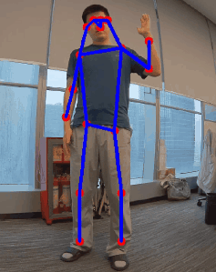

<div >
  <h1>Sample Hrnet Pose Estimation</h1>
  <p align="center">
</div>




---

## 👋 Overview

The **sample_hrnet_pose_estimation** sample provides high-precision human pose estimation capabilities.
It processes input images and publishes the following ROS 2 topics:

- **`/pose_estimation_results`**: Output images with visualized pose keypoints.
- **`/pose_estimation_points`**: Raw keypoint coordinates in a structured message format.

For model information, please refer to [HRNetPose - Qualcomm AI Hub](https://aihub.qualcomm.com/iot/models/hrnet_pose?searchTerm=hrnet)


| Node Name                                                    | Function                                                     |
| ------------------------------------------------------------ | ------------------------------------------------------------ |
| `hrnet_pose_estimation_node` | The node subscribes to /image_raw for image input, performs pose estimation, and publishes the results to /pose_estimation_results and /pose_estimation_points topics. |
| `image_publisher_node` | image_publisher is a ros jazzy packages, can publish image ros topic with local path. For more detail, Please refer to [image_publisher](https://github.com/ros-perception/image_pipeline). |
|`qrb_ros_camera`| The QRB ROS Camera is a ROS package to publish the images from Qualcomm CSI and GMSL cameras. For more detail, Please refer to [QRB ROS CAMERA](https://github.com/qualcomm-qrb-ros/qrb_ros_camera).|
|`qrb_ros_nn_inference`| QRB_ROS_NN_inference is a ROS2 package for performing neural network model, providing AI-based perception for robotics applications. For more detail, Please refer to [QRB ROS NN Inference](https://github.com/qualcomm-qrb-ros/qrb_ros_nn_inference). |


## 🔎 Table of contents

  * [Used ROS Topics](#-used-ros-topics)
  * [Supported targets](#-supported-targets)
  * [Installation](#-installation)
  * [Usage](#-usage)
  * [Build from source](#-build-from-source)
  * [Contributing](#-contributing)
  * [Contributors](#%EF%B8%8F-contributors)
  * [FAQs](#-faqs)
  * [License](#-license)

## ⚓ Used ROS Topics 

| ROS Topic                       | Type                                       | Description                                                  |
| ------------------------------- | ------------------------------------------ | ------------------------------------------------------------ |
| `/image_raw `                   | `sensor_msgs.msg.Image `                   | The sample hrnet pose estimation input image.                |
| `/qrb_inference_input_tensor `  | `qrb_ros_tensor_list_msgs/msg/TensorList ` | The preprocessed image is converted into an input msg for nn inference. |
| `/qrb_inference_output_tensor ` | `qrb_ros_tensor_list_msgs/msg/TensorList ` | Message after nn inference inference                         |
| `/pose_estimation_results`      | `sensor_msgs.msg.Image`                    | Output images with visualized pose keypoints.                |
| `/pose_estimation_points`       | `geometry_msgs.msg.PolygonStamped`         | Raw keypoint coordinates in a structured message format.     |

Note: `/pose_estimation_points` contains the coordinates of 17 key points on the original image. Developers can subscribe to this topic for secondary development. Key points include: nose, left eye, right eye, etc. The specific correspondence is as follows: 

| ID  | Body Part      | ID  | Body Part      |
|-----|----------------|-----|----------------|
| 1   | Nose           | 10  | Right Wrist    |
| 2   | Right Eye      | 11  | Left Wrist     |
| 3   | Left Eye       | 12  | Right Hip      |
| 4   | Right Ear      | 13  | Left Hip       |
| 5   | Left Ear       | 14  | Right Knee     |
| 6   | Right Shoulder | 15  | Left Knee      |
| 7   | Left Shoulder  | 16  | Right Ankle    |
| 8   | Right Elbow    | 17  | Left Ankle     |
| 9   | Left Elbow     |     |                |

## 🎯 Supported targets

<table >
  <tr>
    <th>Development Hardware</th>
     <td>Qualcomm Dragonwing™ IQ-9075 EVK</td>
  </tr>
  <tr>
    <th>Hardware Overview</th>
    <th><a href="https://www.qualcomm.com/products/internet-of-things/industrial-processors/iq9-series/iq-9075"></a></th>
  </tr>
  <tr>
    <th>GMSL Camera Support</th>
    <td>LI-VENUS-OX03F10-OAX40-GM2A-118H(YUV)</td>
  </tr>
</table>


## ✨ Installation

> [!IMPORTANT]
> **PREREQUISITES**: The following steps need to be run on **Qualcomm Ubuntu** and **ROS Jazzy**.<br>
> Reference [Install Ubuntu on Qualcomm IoT Platforms](https://ubuntu.com/download/qualcomm-iot) and [Install ROS Jazzy](https://docs.ros.org/en/jazzy/index.html) to setup environment. <br>
> For Qualcomm Linux, please check out the [Qualcomm Intelligent Robotics Product SDK](https://docs.qualcomm.com/bundle/publicresource/topics/80-70018-265/introduction_1.html?vproduct=1601111740013072&version=1.4&facet=Qualcomm%20Intelligent%20Robotics%20Product%20(QIRP)%20SDK) documents.

Add Qualcomm IOT PPA for Ubuntu:

```bash
sudo add-apt-repository ppa:ubuntu-qcom-iot/qcom-ppa
sudo add-apt-repository ppa:ubuntu-qcom-iot/qirp
sudo apt update
```

<!-- Install Debian package:

```bash
sudo apt install ros-jazzy-sample-hrnet-pose-estimation
``` -->

## 🚀 Usage

<details>
  <summary>Usage details</summary>
Run the sample on device

At present, the sample cannot be installed through apt install. Please refer to the [Build from source](#-build-from-source) section for compilation before use.At present, the sample cannot be installed through apt install. Please refer to the build from source section for compilation before use.

```bash
# setup runtime environment
source /opt/ros/jazzy/setup.bash
export ROS_DOMAIN_ID=124

# Launch the sample with image publisher, You can replace 'image_path' with the path to your desired image.
ros2 launch sample_hrnet_pose_estimation launch_with_image_publisher.py image_path:=/opt/ros/jazzy/share/sample_hrnet_pose_estimation/input_image.jpg
```

Open a new terminal and use rqt to view topic `/pose_estimation_results`.

Open a new terminal and run the following command to view the `/pose_estimation_points` topic.

```
source /opt/ros/jazzy/setup.bash
export ROS_DOMAIN_ID=124
ros2 topic echo /pose_estimation_points
```

</details>

## 👨‍💻 Build from source

<details>
  <summary>Build from source details</summary>

- Install `ros-dev-tools` .
```bash
sudo apt install ros-dev-tools
```

- Install dependency Debian packages from qcom ppa.
```bash
sudo add-apt-repository ppa:ubuntu-qcom-iot/qcom-ppa
sudo add-apt-repository ppa:ubuntu-qcom-iot/qirp
sudo apt update
```

- Download source code from qrb-ros-sample repository.
```bash
mkdir -p ~/qrb_ros_sample_ws/src && cd ~/qrb_ros_sample_ws/src
git clone -b jazzy-rel https://github.com/qualcomm-qrb-ros/qrb_ros_samples.git
```

- Download model.
```bash
sudo mkdir -p /opt/model && cd /opt/model

wget https://huggingface.co/qualcomm/HRNetPose/resolve/6011b6e69a84dad8f53fb555b11035a5e26c8755/HRNetPose.bin?download=true -O HRNetPose.bin
```

- Build sample from source code.
```bash
cd ~/qrb_ros_sample_ws/src/qrb_ros_samples/ai_vision/sample_hrnet_pose_estimation
rosdep install -i --from-path ./ --rosdistro jazzy -y
colcon build
source install/setup.bash
```

- Refer to the "Launch demo steps" section in Usage details to run the demo.

</details>

## 🤝 Contributing

We love community contributions! Get started by reading our [CONTRIBUTING.md](CONTRIBUTING.md).<br>
Feel free to create an issue for bug report, feature requests or any discussion💡.

## ❤️ Contributors

Thanks to all our contributors who have helped make this project better!

<table>
  <tr>
    <td align="center"><a href="https://github.com/Ceere"><br /><sub><b>Ceere</b></sub></a></td>
  </tr>
</table>


## ❔ FAQs

<details>
<summary>Can multiple people be detected?</summary><br>
No, if multiple people need to be detected, please segment the images of multiple people into individual ones and perform separate detection.
</details>


## 📜 License

Project is licensed under the [BSD-3-Clause](https://spdx.org/licenses/BSD-3-Clause.html) License. See [LICENSE](../../LICENSE) for the full license text.
