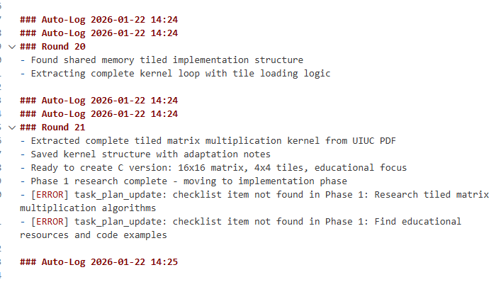
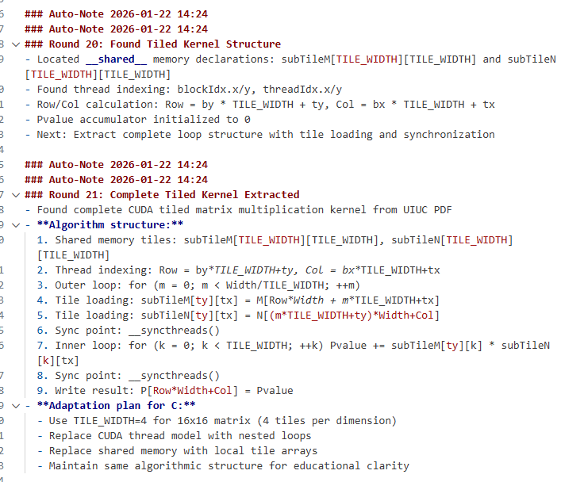
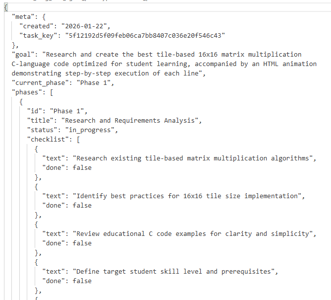
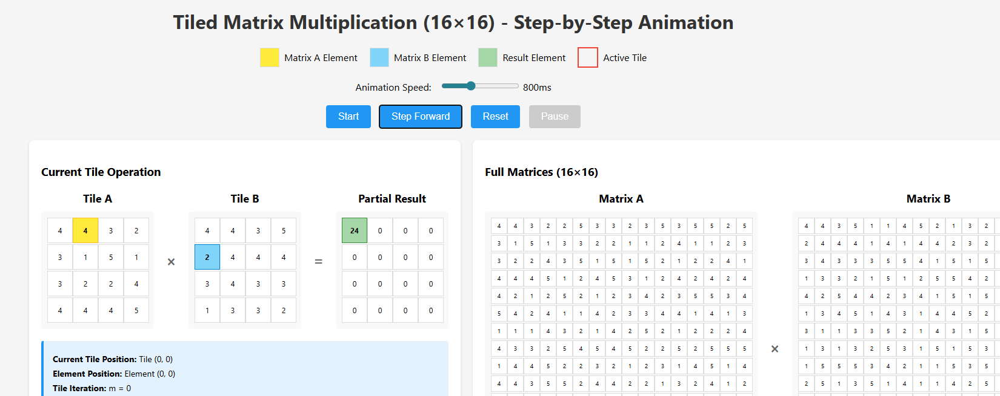
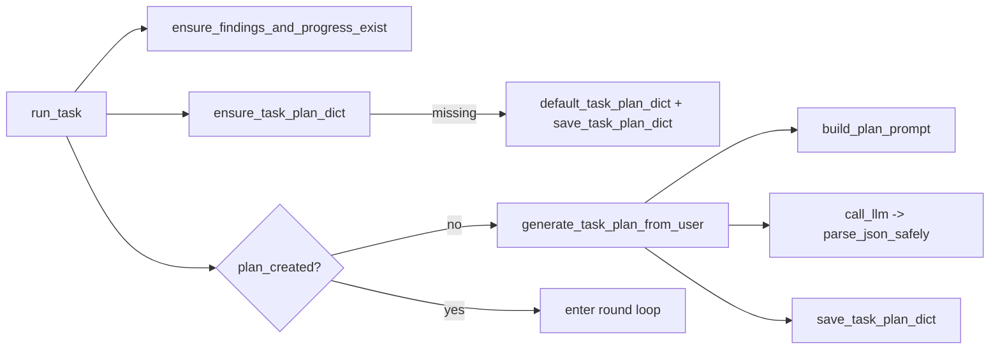
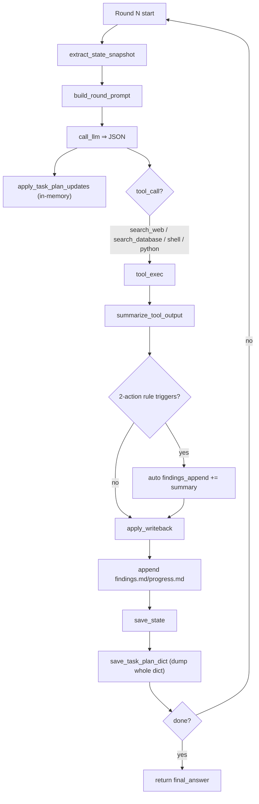

# Prototype Long Task Agent (Manus-like)

This implementation is based directly on the tutorial: [LLM Agents are simply Graph — Tutorial For Dummies](https://zacharyhuang.substack.com/p/llm-agent-internal-as-a-graph-tutorial).

---
This specific project is inspired by : https://github.com/OthmanAdi/planning-with-files


## Features (planing)

- support multiple rounds of inference 
- no context explosion 

## Example Outputs

**TASK = "research the best tile-based 16*16 mat-mul c-language code for students, alone with html animation demostrating how each line is executed."**


`progress.md`



`findings.md`



`task_plan.md`



`output`




## 1) Manus-like Long Task Agent Breakdown

This is **not** a one-shot Q&A chatbot. It is an *agentic runner* where:
- The LLM must emit **strict JSON** each round (including `tool_call` + `writeback`).
- The runtime executes tools, writes files, tracks state, and enforces round control.
- Long-term memory is **on disk**, reusable across rounds/process restarts.

### Advantage 1: Resume-safe & Auditable (Disk Memory)
- Traditional LLMs rely on the context window and can lose goals/decisions/intermediate results.
- This prototype persists key state to disk:
  - `.pwf_state.json`: runtime state (last tool result, counters, task_key, plan_created, etc.)
  - `task_plan.md`: the plan as a **JSON dict (YAML 1.2 subset)** 
  - `findings.md / progress.md`: append-only logs for auditability
- Uses `task_key = sha1(normalized user_message)` to fingerprint tasks and auto-reset files when a new task starts.

### Advantage 2: Stronger Process Control (Schema-driven + 1 tool call)
Each round must **Return JSON only** and obey:
- `writeback MUST be present every turn`
- `At most ONE tool_call per turn` (forces multi-step work into multiple controlled rounds)
- Allowed tools implemented by the runner: `shell | python | search_web | search_database`
- Fixed writeback channels every round:
  - `findings_append[]`
  - `progress_append[]`
  - `task_plan_updates{ phase_status[], checklist_set[] }`

### Advantage 3: More Stable Long-Chain Behavior (2-Action Rule + truncation + forced dump)
- **2-Action Rule**: when `actions_since_last_findings >= 2` and the model didn’t write findings, the runner auto-appends `last_tool_result.summary` to `findings.md`.
- **Tool output truncation**: `MAX_TOOL_OUTPUT_CHARS = 1200` to prevent prompt blow-ups.
- **Forced plan dump**: at end of each round, the in-memory plan dict is dumped to `task_plan.md`.

---

## 2) Artifacts (Files)

| File | Purpose |
|---|---|
| `.pwf_state.json` | Runtime state (resume info, counters, last tool result) |
| `task_plan.md` | Plan as a **JSON dict**, in-memory is source of truth; dumped every round |
| `findings.md` | Findings & decisions (timestamped append) |
| `progress.md` | Progress log (timestamped append; actions/tests/errors) |

`task_plan.md` is not free-form text; it is a structured dict.

---

## 3) Function-level Call Flow (ASCII)

```text
__main__
  |
  v
main
  |
  +--> compute_task_key(user_message)
  +--> load_state() -> read_text(.pwf_state.json)
  |
  +--> IF st.task_key != current_key
  |       +--> reset_all_files_for_new_task(user_message)
  |              +--> truncate task_plan.md/findings.md/progress.md
  |              +--> save_state(default_state + task_key + root_user_message)
  |
  v
run_task(user_message)
  |
  +--> ensure_findings_and_progress_exist()
  |
  +--> ensure_task_plan_dict(task_key)
  |       +--> load_task_plan_dict() -> json.loads(task_plan.md)
  |       +--> if None: default_task_plan_dict() + save_task_plan_dict()
  |
  +--> IF not plan_created OR task_plan missing
  |       +--> generate_task_plan_from_user()
  |              +--> build_plan_prompt()
  |              +--> call_llm()
  |              +--> parse_json_safely()
  |              +--> save_task_plan_dict(plan)
  |       +--> state.plan_created = True
  |
  v
FOR round_id in 1..MAX_ROUNDS
  |
  +--> read findings.md / progress.md
  +--> extract_state_snapshot(task_plan_dict, findings, progress)
  +--> build_round_prompt(...)
  +--> call_llm() -> parse_json_safely()
  |
  +--> apply_task_plan_updates(task_plan_dict, writeback.task_plan_updates)
  |
  +--> (optional) run ONE tool: shell/python/search_web/search_database
  |       +--> summarize_tool_output()
  |       +--> state.last_tool_result = {tool, exit_code, summary}
  |
  +--> 2-action fallback:
  |       IF actions_since_last_findings>=2 AND findings_append empty
  |          +--> auto findings_append += last_tool_result.summary
  |
  +--> apply_writeback() -> append findings.md/progress.md
  +--> save_state()
  +--> save_task_plan_dict(task_plan_dict)  # end-of-round dump
  |
  +--> IF done: return final_answer
END FOR
```

---

## 4) Workflow (Mermaid)

### 4.1 Bootstrap: templates + initial plan dict



### 4.2 Each round: tool + writeback + auto-summarize + dump




## Getting Started

TBD
## How It Works?

TBD
