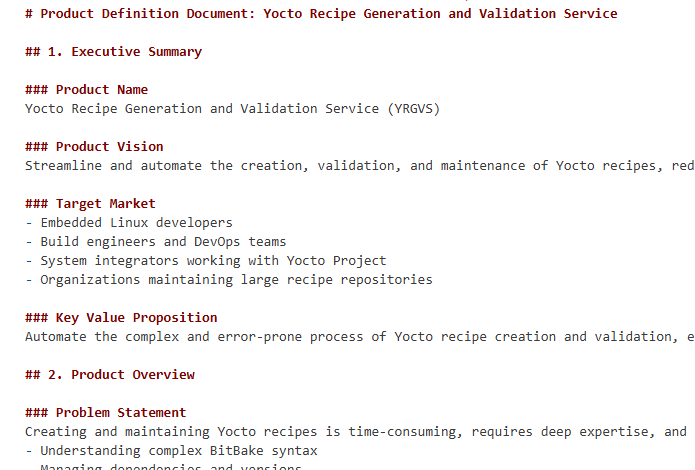
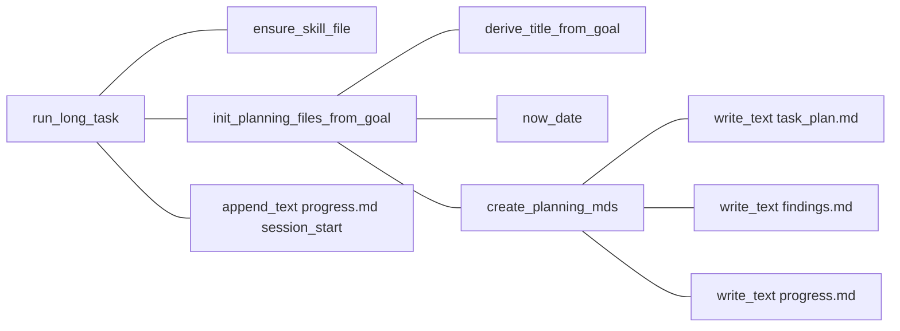
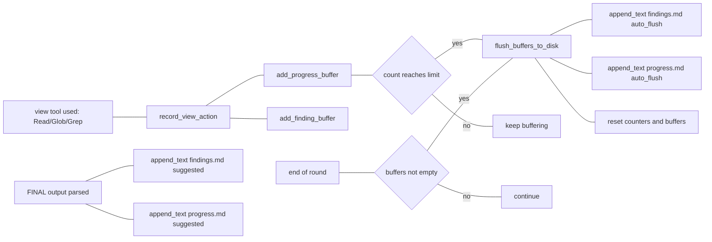

# Prototype Long Task Agent (Manus-like)

This implementation is based directly on the tutorial: [LLM Agents are simply Graph — Tutorial For Dummies](https://zacharyhuang.substack.com/p/llm-agent-internal-as-a-graph-tutorial).

---
This specific project is inspired by : https://github.com/OthmanAdi/planning-with-files


## Features (planing)

- Use pre-downloaded 7M words of large text file
- Cut into chunks and build vector database with Hierarchical Navigable Small Worlds (HNSW) 
- Search Vector with HNSW instead of Brute Computation

## Example Outputs

progress.md


findings.md


task_plan.md


tool call #1 


tool call #2


output



## Long Task Agent Technical Breakdown


### planning-with-files: a Manus-like Agentic Long-Task Prototype

### 1) Overview (What it is and why it beats a conventional chat LLM)
This is **not** a “single-turn Q&A” chat bot. It is a **Manus-like agentic long-task prototype** that breaks complex work into multiple **Rounds** and persists key state to disk (`task_plan.md`, `findings.md`, `progress.md`) as **durable working memory**.

**Advantage 1 — Resume-safe and auditable (Disk memory)**
- Traditional LLMs rely on a limited context window, so long tasks often lose goals, decisions, and intermediate results.
- This prototype writes critical state to `task_plan.md / findings.md / progress.md`, enabling reuse **across rounds and across processes**.
- `get_next_round_id()` parses completed rounds from `progress.md` and returns `max + 1`, making execution **checkpoint/resume-friendly**.

**Advantage 2 — Stronger process control (Director → Nodes → Tool Loop)**
- Traditional LLM usage often mixes planning, research, execution, and review in a single response, which is hard to constrain and reuse.
- This prototype separates responsibilities into a **Director** and multiple **Nodes** (`planner / researcher / executor / reviewer`).
- The Director (`llm_director_next_round()`) generates each round’s **objective** and **node list**; each node executes via `llm_node_tool_loop()` using a strict **TOOL_CALL / FINAL** protocol.

**Advantage 3 — More stable long-horizon behavior (protocols + guardrails + forced persistence)**
- **Tool allowlist**: only `Read / Write / Edit / Bash / Glob / Grep`, enforced at `tool_call()`.
- **PreToolUse hook**: prints `task_plan.md` head-30 before every tool call to reduce drift.
- **2-Action Rule**: after every two view-like actions (`Read/Glob/Grep`, excluding reads of planning files), it forces `flush_buffers_to_disk()`.
- **De-noising & de-dup**: `summarize_tool_result()` plus tool+args de-dup with `xN` prevents prompts from exploding.
- **Repeated-Read guardrail**: within a node, reading the same path more than twice is blocked and the model is pushed to use `Grep` instead.

### 2) Call Loop by Function Name (Top-down ASCII)

```text
__main__
  |
  v
run_long_task
  |
  +--> ensure_skill_file
  |
  +--> init_planning_files_from_goal
  |       |
  |       +--> derive_title_from_goal
  |       +--> now_date
  |       +--> create_planning_mds
  |              +--> write_text(task_plan.md)
  |              +--> write_text(findings.md)
  |              +--> write_text(progress.md)
  |
  +--> append_text(progress.md, Session Start)
  |
  v
WHILE (main round loop)
  |
  +--> get_next_round_id
  |       +--> read_text(progress.md)
  |
  +--> llm_director_next_round
  |       +--> load_disk_context_for_prompt
  |       |       +--> read_text(task_plan.md)  -> head_n_lines
  |       |       +--> read_text(findings.md)   -> tail_n_lines
  |       |       +--> read_text(progress.md)   -> tail_n_lines
  |       +--> build_director_prompt
  |       +--> call_llm
  |       +--> parse_round_plan_json
  |       +--> sanitize nodes (dedup against AVAILABLE_NODES)
  |
  +--> IF stop == true
  |       +--> append_text(progress.md, Director decided to stop)
  |       +--> BREAK
  |
  +--> ELSE
  |       +--> log_round_start
  |       +--> FOR node in nodes
  |              v
  |           llm_node_tool_loop (max_steps)
  |              +--> load_disk_context_for_prompt
  |              +--> build_node_prompt
  |              +--> call_llm
  |              +--> parse_tool_call
  |              +--> IF TOOL_CALL
  |              |       +--> (Read repeat guardrail > 2) -> continue
  |              |       +--> tool_call
  |              |       |       +--> pre_tool_use_hook
  |              |       |       +--> dispatch Read/Write/Edit/Glob/Grep/Bash
  |              |       |       +--> post_tool_use_hook
  |              |       +--> summarize_tool_result -> de-dup recent_tool_outputs (xN)
  |              |       +--> IF is_view_action
  |              |               +--> record_view_action
  |              |                       +--> add_progress_buffer
  |              |                       +--> IF view_action_count reaches limit
  |              |                               +--> flush_buffers_to_disk
  |              +--> ELSE (FINAL)
  |                      +--> parse_final_writes
  |                      +--> append_text(findings.md, LLM Suggested Findings)
  |                      +--> append_text(progress.md, LLM Suggested Progress)
  |                      +--> return (end node)
  |
  +--> end-of-round: IF buffers not empty
          +--> flush_buffers_to_disk

END WHILE
  |
  +--> stop_hook_check_complete
  +--> append_text(progress.md, Session ended)
```

### 3) Workflow (Mermaid: plan creation + findings/progress management only)






## Getting Started

TBD
## How It Works?

TBD
