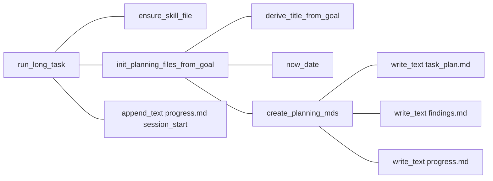
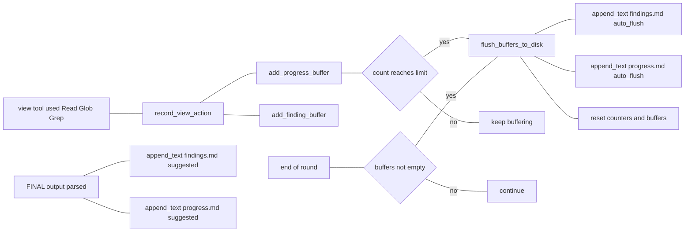
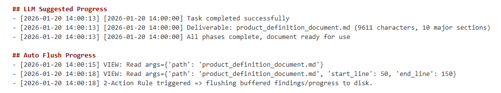
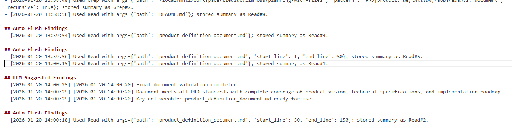
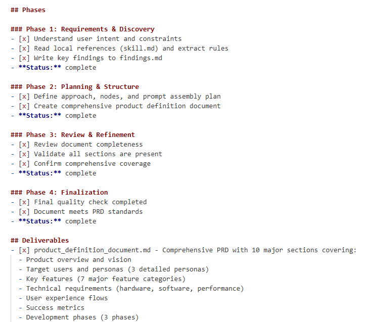
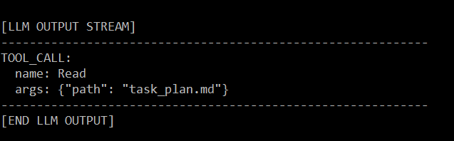
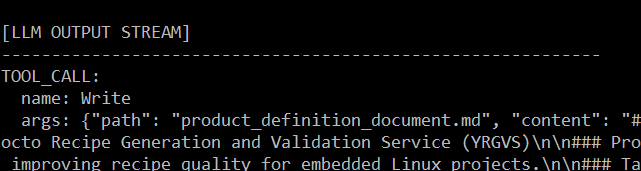

# Prototype Long Task Agent (Manus-like)


## 1) Overview（相对传统 LLM 的优势｜分段清晰）
**这不是“一问一答”的聊天式 LLM**。它是一个 *manus-like* 的 **agentic 长任务执行原型**：把长任务拆成多轮（Round）可执行步骤，并把关键状态写入磁盘文件（`task_plan.md / findings.md / progress.md`）作为**持久化工作记忆**。

**优势 1：可恢复与可审计（Disk Memory + Resume-safe）**
- 传统 LLM 主要依赖上下文窗口：长任务容易丢目标、丢决策、丢中间结论。
- 本原型把关键状态落盘到 `task_plan.md/findings.md/progress.md`，实现跨轮次、跨进程复用。
- `get_next_round_id()` 会从 `progress.md` 解析已执行 Round 并返回 `max+1`，因此**断点恢复友好**。

**优势 2：更强的过程控制（Director → Nodes → Tool Loop）**
- 传统 LLM 往往把“规划/研究/执行/复盘”混在一次输出里，难以约束与复用。
- 本原型把职责拆为 Director 与多个节点（planner/researcher/executor/reviewer）。
- Director 用 `llm_director_next_round()` 生成每轮 objective 与 nodes；节点用 `llm_node_tool_loop()` 以 `TOOL_CALL/FINAL` 协议驱动多步执行。

**优势 3：更稳的长链路行为（协议 + 护栏 + 强制写盘）**
- **工具白名单**：仅允许 `Read/Write/Edit/Bash/Glob/Grep`，并在 `tool_call()` 入口校验。
- **PreToolUse Hook**：每次工具前打印 `task_plan.md` head-30，减少跑偏。
- **2-Action Rule**：每两次 view-like（Read/Glob/Grep，且读取 planning 文件不计）就强制 `flush_buffers_to_disk()`。
- **去噪与去重**：`summarize_tool_result()` + tool+args 去重计数（xN）避免 prompt 被工具输出撑爆。
- **重复 Read 护栏**：同一节点内对同一路径 Read 超过 2 次会被阻止并建议改用 Grep。

---


## 2) 基于函数名的调用循环（ASCII 从上到下换行展示）

```text
__main__
  |
  v
run_long_task
  |
  +--> ensure_skill_file
  |
  +--> init_planning_files_from_goal
  |       |
  |       +--> derive_title_from_goal
  |       +--> now_date
  |       +--> create_planning_mds
  |              +--> write_text(task_plan.md)
  |              +--> write_text(findings.md)
  |              +--> write_text(progress.md)
  |
  +--> append_text(progress.md, Session Start)
  |
  v
WHILE (main round loop)
  |
  +--> get_next_round_id
  |       +--> read_text(progress.md)
  |
  +--> llm_director_next_round
  |       +--> load_disk_context_for_prompt
  |       |       +--> read_text(task_plan.md)  -> head_n_lines
  |       |       +--> read_text(findings.md)   -> tail_n_lines
  |       |       +--> read_text(progress.md)   -> tail_n_lines
  |       +--> build_director_prompt
  |       +--> call_llm
  |       +--> parse_round_plan_json
  |       +--> sanitize nodes (AVAILABLE_NODES dedup)
  |
  +--> IF stop == true
  |       +--> append_text(progress.md, Director decided to stop)
  |       +--> BREAK
  |
  +--> ELSE
  |       +--> log_round_start
  |       +--> FOR node in nodes
  |              v
  |           llm_node_tool_loop (max_steps)
  |              +--> load_disk_context_for_prompt
  |              +--> build_node_prompt
  |              +--> call_llm
  |              +--> parse_tool_call
  |              +--> IF TOOL_CALL
  |              |       +--> (Read repeat guardrail over 2) -> continue
  |              |       +--> tool_call
  |              |       |       +--> pre_tool_use_hook
  |              |       |       +--> dispatch Read/Write/Edit/Glob/Grep/Bash
  |              |       |       +--> post_tool_use_hook
  |              |       +--> summarize_tool_result -> de-dup recent_tool_outputs (xN)
  |              |       +--> IF is_view_action
  |              |               +--> record_view_action
  |              |                       +--> add_progress_buffer
  |              |                       +--> IF view_action_count reaches limit
  |              |                               +--> flush_buffers_to_disk
  |              +--> ELSE (FINAL)
  |                      +--> parse_final_writes
  |                      +--> append_text(findings.md, LLM Suggested Findings)
  |                      +--> append_text(progress.md, LLM Suggested Progress)
  |                      +--> return (end node)
  |
  +--> end-of-round: IF buffers not empty
          +--> flush_buffers_to_disk

END WHILE
  |
  +--> stop_hook_check_complete
  +--> append_text(progress.md, Session ended)
```

---

## 3) Workflow（Mermaid：只显示创建 plan 与管理 findings/progress）




## Example Outputs

progress.md


findings.md


task_plan.md


tool_call_1.md



tool_call_2.md

