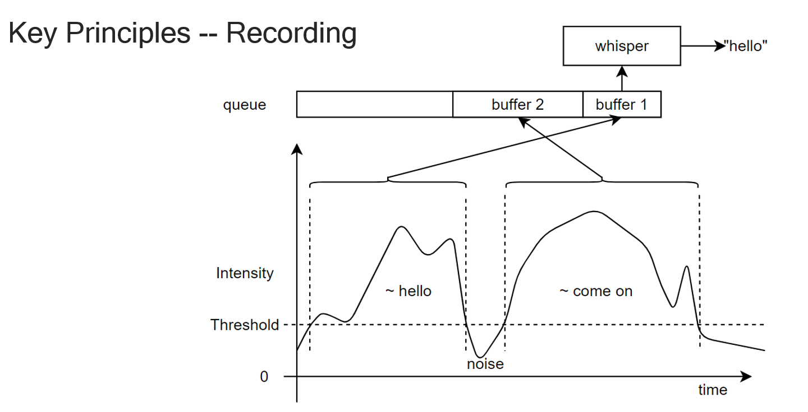
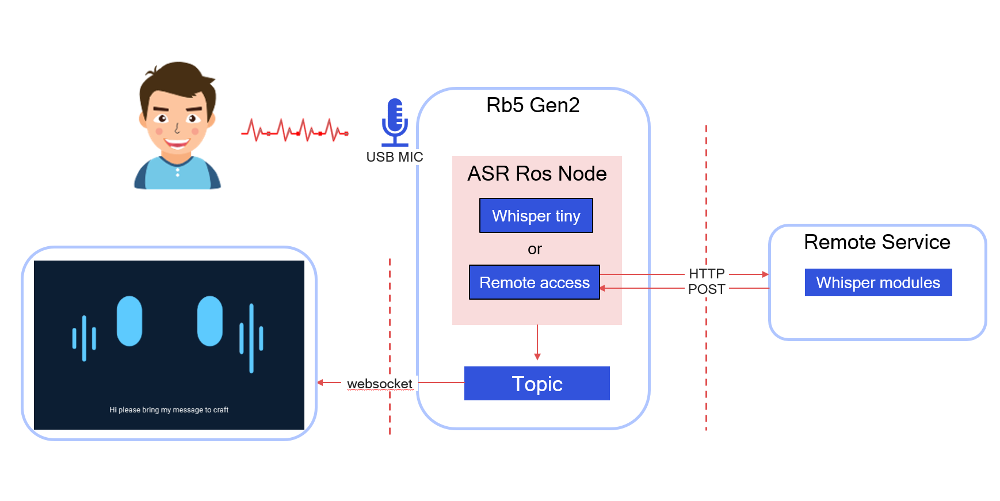

# AI Samples Speech Recognition ROS Node

## Overview

Samples Speech Recognition ROS Node provide a ASR RT ROS Node for developers to directly develop applications.

This ASR RT ROS Node realizes real-time speech recognition of complete sentences through real-time detection of sound intensity.
This ASR RT ROS Node enables Collect voice through USB MIC and supports three usage scenarios:
1: local mode: Running the AI-Hub whisper tiny model in local to convert audio date into text;
2: remote mode: Run a larger whisper model in a self-built remote service to convert audio data into text;
3: In addition to USB mic, it also supports voice recognition of remote voice topic.
Developers can directly use this ROS Node to group the application pipeline.

To embrace open source and robotics developerment, we have developed the Speech Recognition ROS Node that support Speech to Text. 
The feature as follows:

- Provide ROS node include
  - support Speech to Text.
  - submit /whisper_enable to enable/disable ASR function.
  - publish /whisper_text to output the result of speech recognition.
  - submit /audio_file to receive remote voice topic.

- limitation
  - Supprots USB MIC.
  - Supports Whisper tiny english model in local that provide by AI-HUB.
  - Supports the remote bigger models, but user need to build them themselves, and we provide guidance.
  - Choice use local model or remote model via config the launch file.

video link 
<video width="1920" height="1080" controls>
  <source src="test/asr_rt_rosnode.mp4" type="video/mp4">
</video>

## Pipeline flow for Speech Recognition ROS Node

### Key Principles of Recording


### usercase for robot face


## Quick Start on UBUNTU

> **Note：**
> This document 's build & run is the latest.
> If it conflict with the online document, please follow this.


#### Setup
1. Create `ros_ws` directory in `<qirp_decompressed_workspace>/qirp-sdk/`.

2. Clone this repository under `<qirp_decompressed_workspace>/qirp-sdk/ros_ws`.
```
git clone https://github.com/quic-shouhu/qrb_ros_samples.git
```

3. Prepare the environment and install dependent packages.
```
source ./qrb_ros_samples/ai_audio/sample_speech_recognition_rt_rosnode/test/install_packages_2.sh
```

4. prepare AI-HUB model.
```
cd ./qrb_ros_samples/ai_audio/sample_speech_recognition_rt_rosnode
mkdir model
```

download MEL FILTER FILE to ./qrb_ros_samples/ai_audio/sample_speech_recognition_rt_rosnode/model.
```
https://qaihub-public-assets.s3.us-west-2.amazonaws.com/qai-hub-models/models/whisper_asr_shared/v1/openai_assets/mel_filters.npz
```

download ENCODING MODEL to ./qrb_ros_samples/ai_audio/sample_speech_recognition_rt_rosnode/model.
```
https://aihub.qualcomm.com/models/whisper_tiny_en?domain=Audio&useCase=Speech+Recognition -> WhisperEncoder -> QCS8550 -> TFLite -> whisper_tiny_en-whisperencoder.tflite
```

download DECODING MODEL to ./qrb_ros_samples/ai_audio/sample_speech_recognition_rt_rosnode/model.
```
https://aihub.qualcomm.com/models/whisper_tiny_en?domain=Audio&useCase=Speech+Recognition -> WhisperDecoder -> QCS8550 -> TFLite -> whisper_tiny_en-whisperdecoder.tflite
```


#### Build
- Build this project.
```
cd ./qrb_ros_samples/ai_audio/sample_speech_recognition_rt_rosnode
source /opt/ros/humble/setup.bash
export WHISPER_MODEL_PATH="<path of your model>"

colcon build --cmake-clean-cache
```

#### Run (qrb_ros_speech_recognition.launch.py)
- Source this file to set up the environment on your device:
```
source install/local_setup.bash
```

Run the ROS2 package.
```
ros2 launch qrb_ros_speech_recognition qrb_ros_speech_recognition.launch.py
```

Run the test Node.
```
python ./qrb_ros_samples/ai_audio/sample_speech_recognition_rt_rosnode/test/qrb_ros_print.py
```

Run the enable Node. Please enter "true" and publish to enable.
```
python ./qrb_ros_samples/ai_audio/sample_speech_recognition_rt_rosnode/test/test_asr_switch.py
```

- You can modify the qrb_ros_speech_recognition.launch.py to set the configrations.
```python
{'AudioEnergyThreshold': 0.5}, # 音频强度的阈值
{'ShortTermWindow': 0.1}, # 计算音频强度的采样时间 s
{'MovingAverageWindow': 30}, # 累计多少个采样强度的窗口长度
{'AvailableWindow': 1}, # 最小有效音频长度限制 s
{'LocalTiny': 1} # 1：运行本地 tiny_en 模型 0:远程服务器大模型
```

#### Run (qrb_ros_android_asr.launch.py) that is for support the robot call android application only
- thia example used to receive the audio from android application and send to remote service ande get the feedback translated text.
- 1: you must have the android app robot call.
- 2: you must run the ros2 launch rosbridge_server rosbridge_websocket_launch.xml on device.
- 3: you must follow the Remote service guidance to establish the remote service.

- Source this file to set up the environment on your device:
```
source install/local_setup.bash
```

Run the ROS2 package.
```
ros2 launch qrb_ros_speech_recognition qrb_ros_android_asr.launch.py
```

Run the test Node.
```
python ./qrb_ros_samples/ai_audio/sample_speech_recognition_rt_rosnode/test/qrb_ros_print.py
```

#### Remote service guidance
This is provide a guidance to let you can establish your remote service with bigger ASR model.

- Prepare the env for service_asr.py in to your remote service.
  
- Establish model in your service.
  Reference https://github.com/openai/whisper
  Example service_asr.py:
```
model = whisper.load_model("turbo", device="cuda")
```

- Modify IP and Port. you should make sure ROS Node use the same IP and Port
Example service_asr.py: "10.92.128.242" is the service's IP, you can modify your port "port=5000".
```
app.run(host='10.92.128.242', port=5000)
```
Example ROS Node qrb_ros_speech_recognition.py:
```
server_url = 'http://10.92.128.242:5000/transcribe'
```

- Modify launch file choice remote service.
Example qrb_ros_speech_recognition.launch.py:
```
{'LocalTiny': 0} # 1：local tiny_en. 0:remote service.
```

- run service_asr.py in your remote service and run ROS Node in local device.

<br>

You can get more details from [here](https://quic-qrb-ros.github.io/main/index.html).
