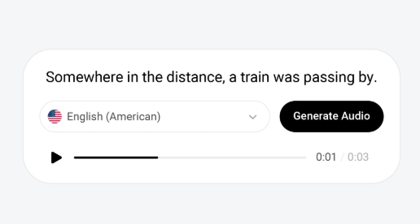
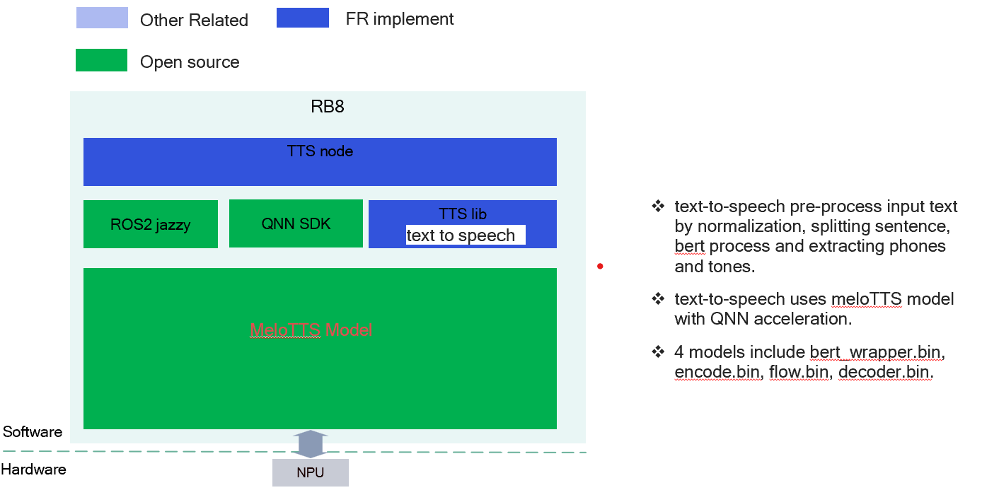
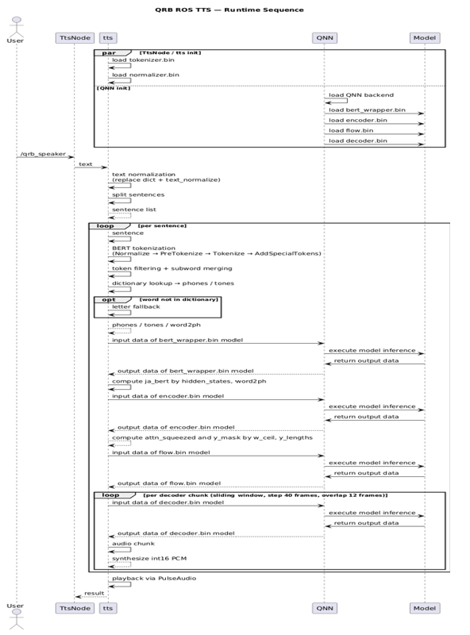

<div >
  <h1>Samples TTS	</h1>
  <p align="center">
</div>



---

## 👋 Overview

The ` tts` sample enables a function that Text-to-Speech case with qrb ros nodes.

It receives the string input by subscription with '/qrb_speaker' and playback audio.

This figure contains the basic messages and data transfer channels, with ROS node.




Details workflow 


## 🔎 Table of contents

  * [Used ROS Topics](#-used-ros-topics)
  * [Supported targets](#-supported-targets)
  * [Build from source](#-build-from-source)
  * [Contributing](#-contributing)
  * [Contributors](#%EF%B8%8F-contributors)
  * [FAQs](#-faqs)
  * [License](#-license)

## ⚓ Used ROS Topics 

| ROS Topic      |           Type          | Published By|
| -------------- | ----------------------- | ----------- |
| `/qrb_speaker` | `std_msgs::msg::String` | qrb ros tts |

## 🎯 Supported targets

<table >
  <tr>
    <th>Development Hardware</th>
     <td>Qualcomm Dragonwing™ IQ-9075 EVK</td>
  </tr>
  <tr>
    <th>Hardware Overview</th>
    <th><a href="https://www.qualcomm.com/products/internet-of-things/industrial-processors/iq9-series/iq-9075"></a></th>
  </tr>
  <tr>
    <th>USB Sound Support</th>
    <td>Wheeltec V20 USB SOUND</td>
  </tr>
</table>


## 👨‍💻 Build from source

<details>
  <summary>Build from source details</summary>

Prepare Model

```
sudo mkdir /home/ubuntu/qnn_bin
cd /home/ubuntu/qnn_bin
# download model from AI Hub: https://aihub.qualcomm.com/iot/models/melotts_en?searchTerm=TTS, please follow below image to select device
# Models include bert_en_tokenizer.bin, bert_normalizer.bin, bert_wrapper.bin, encoder.bin, flow.bin, decoder.bin
scp all models to ubuntu@{wlan ip}:/home/ubuntu/qnn_bin
```


Install dependencies

```
sudo apt install -y software-properties-common
sudo add-apt-repository ppa:ubuntu-qcom-iot/qcom-ppa
sudo apt update
sudo apt install -y libqnn-dev libqnn1
sudo apt install -y libpulse-dev
```

Download the source code and build with colcon

```bash
source env.sh
git clone https://github.com/qualcomm-qrb-ros/qrb_ros_samples.git
cd qrb_ros_samples/ai_audio/sample_tts
colcon build
source ./install/setup.sh
```

Run the sample env on device

```
ros2 launch qrb_ros_tts qrb_ros_tts.py

# connect USB speaker to device with USB TypeA to Type C converter

#open another terminal to send input text
ros2 topic pub /qrb_speaker std_msgs/String "{data: 'Hello World'}"

```


</details>

## 🤝 Contributing

We love community contributions! Get started by reading our [CONTRIBUTING.md](CONTRIBUTING.md).<br>
Feel free to create an issue for bug report, feature requests or any discussion💡.

## ❤️ Contributors

Thanks to all our contributors who have helped make this project better!

<table>
  <tr>
    <td align="center"><a href="https://github.com/ThomasChen1296"><br /><sub><b>ThomasChen1296</b></sub></a></td>
  </tr>
</table>


## ❔ FAQs

<details>
<summary>NA</summary><br>
</details>


## 📜 License

Project is licensed under the [BSD-3-Clause](https://spdx.org/licenses/BSD-3-Clause.html) License. See [LICENSE](./LICENSE) for the full license text.

