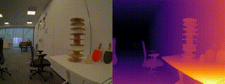
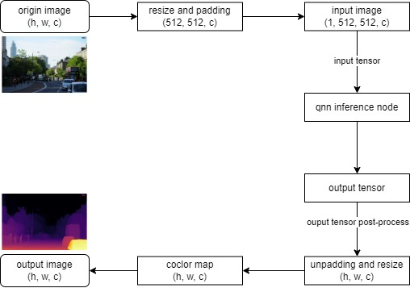

# AI Samples depth estimation

## Overview

`sample_depth_estimation` is a Python-based depth estimation ROS node that uses QNN for model inference. The model is sourced from [Depth Anything V2](https://huggingface.co/qualcomm/Depth-Anything-V2) that a deep convolutional neural network model for depth estimation.This sample allows you to input an RGB image named `input_image.jpg` or `image_raw` topic published by ross-jazzy-usb-cam, then it will publish the result as ROS topic `/depth_map`. 
For more information, plaease refer to: [qrb_ros_sample/sample_depth_estimation](https://github.qualcomm.com/QUIC-QRB-ROS/qrb_ros_samples/tree/jazzy/ai_vision/sample_depth_estimation)



## Pipeline flow for depth estimation



## Support platforms
| Hardware               | Software                                 |
| ---------------------- | ---------------------------------------- |
| IQ-9075 Evaluation Kit | Qualcomm Linux, Qualcomm Ubuntu |

## ROS Nodes used in depth estimation

| ROS Node                | Description                                                  |
| ----------------------- | ------------------------------------------------------------ |
| `depth_estimation_node`    | depth_estimation_node is a python-based ros jazzy packages realize depth estimation of each pixel,  uses the QNN tool for model inference. This ROS node subscribes image topic, and publishs depth map result topic after pre-post process. |
| `image_publisher_node` | image_publisher_node is  a ros jazzy packages, can publish image ros topic with local path. source link: [ros-perception/image_pipeline: An image processing pipeline for ROS.](https://github.com/ros-perception/image_pipeline) |
| `qrb_ros_camera_node` |  qrb_ros_camera_node is a ROS package to publish the images from Qualcomm CSI and GMSL cameras. source link: [qrb ros camera](https://github.com/qualcomm-qrb-ros/qrb_ros_camera) |


## ROS Topics used in depth estimation

| ROS Topic                      | Type                         | Published By            |
| ------------------------------ | ---------------------------- | ----------------------- |
| `depth_map ` | `<sensor_msgs.msg.Image> ` | `depth_estimation_node`     |
| `image_raw`                   | `<sensor_msgs.msg.Image> `  | `image_publisher` |
| `qrb_inference_input_tensor`                   | `<TensorList> `  | `depth_estimation_node` |
| `qrb_inference_output_tensor`                   | `<TensorList> `  | `qrb_ros_nn_inference` |


## Use cases on QCLINUX

### Prerequisites
- Please refer to [Settings](https://docs.qualcomm.com/bundle/publicresource/topics/80-70018-265/download-the-prebuilt-robotics-image_3_1.html?vproduct=1601111740013072&version=1.4&facet=Qualcomm%20Intelligent%20Robotics%20Product%20(QIRP)%20SDK) to complete the device and host setup.


### 1. On Host

Step 1: Build sample project

On the host machine, move to the artifacts directory and decompress the qirp-sdk package using the tar command.

```bash
# set up qirp sdk environment
tar -zxf qirp-sdk_<qirp_version>.tar.gz
cd <qirp_decompressed_path>/qirp-sdk
source setup.sh

# build sample
cd <qirp_decompressed_path>/qirp-samples/ai_vision/sample_depth_estimation

colcon build
```

Step 2: Package and push sample to device
```bash
# package depth estimation sample
cd <qirp_decompressed_path>/qirp-samples/ai_vision/sample_depth_estimation/install/sample_depth_estimation
tar -czvf sample_depth_estimation.tar.gz lib share


# push to device
scp sample_depth_estimation.tar.gz root@[ip-addr]:/opt/
```


### 2. On Device
To Login to the device, please use the command `ssh root@[ip-addr]`, default password is `oelinux123`.

Step 1: Decompress sample package

```bash
# Remount the /usr directory with read-write permissions
(ssh) mount -o remount rw /usr

# Install sample package and model package
(ssh) cd /opt && tar --no-same-owner -zxf /opt/sample_depth_estimation.tar.gz -C /usr/
```

Step 2: Setup runtime environment

```bash
# Set HOME variable
(ssh) export HOME=/opt

# setup runtime environment
(ssh) source /usr/bin/ros_setup.sh && source /usr/share/qirp-setup.sh
(ssh) export ROS_DOMAIN_ID=42
```

Step 3: Run sample

Launch the sample depth estimation node with an image publisher, please replace `image_path` with the path to your desired image, the `model_path` should be the path to the downloaded model file.

- launch with image publisher
```bash
ros2 launch sample_depth_estimation launch_with_image_publisher.py
```
- Launch with qrb ros camera
```bash
ros2 launch sample_depth_estimation launch_with_qrb_ros_camera.py
```
If success, the log `[depth_estimation_node-2] [INFO] [1742428958.023415773] [depth_estimation_node]: Published depth map` will be shown.

Then, follow these steps to launch rqt and view the depth map results:
1. Select `Plugins` from the menu.
2. Navigate to `Visualization`.
3. Choose `Image View`.

```bash
(ssh) export DISPLAY=<YOUR_HOST_IP>:0
(ssh) export ROS_DOMAIN_ID=42
(ssh) rqt
```