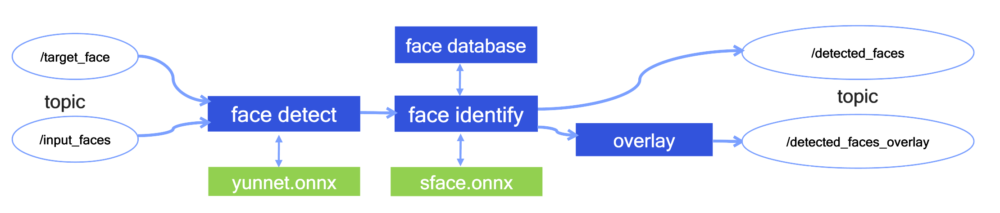
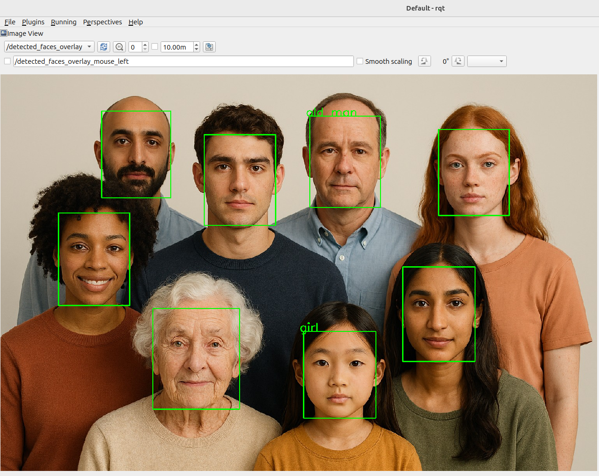

<div align="center">
  <h1>AI Samples - Face Recognition</h1>

  

  <div style="margin-top: 12px;">
    <a href="https://ubuntu.com/download/qualcomm-iot" target="_blank">
      
    </a>
    <a href="https://docs.ros.org/en/jazzy/" target="_blank">
      
    </a>
  </div>
</div>

## 👋 Overview
The sample_face_recognition node is a C++‑based ROS node for face recognition, use open‑source models to perform face detection and identification.

* Face detection is implemented using the YuNet model to detect faces and obtain facial landmark information.
* Face identification is performed using the SFace model, which generates facial embeddings from the detected landmarks and matches them with pre‑registered face data.

For model information of yunnet.onnx & sface.onnx, please refer to https://github.com/opencv/opencv_zoo

## Pipeline For Face Recognition Node



| functional submodules       | Description                                                  |
| ---------------- | ------------------------------------------------------------ |
| "face detect" |  use ynnet.onnx to obtain facial landmark info and pass them to "face identify" submodules |
| "face identify" |  use sface.onnx to generates & match facial landmark data |
| "face database" |  manager the pre‑registered face data from user settting path |
| "overlay" |  draw the recognition results on the input image |

## 🔎 Table of Contents
- [👋 Overview](#-overview)
- [Pipeline For Face Recognition Node](#pipeline-for-face-recognition-node)
- [🔎 Table of contents](#-table-of-contents)
- [Used ROS Topics](#-used-ros-topics)
- [Supported targets](#-supported-targets)
- [Installation](#-installation)
- [Prerequisites](#prerequisites)
- [⚓ Used ROS Topics](#-used-ros-topics)
- [🎯 Supported targets](#-supported-targets)
- [✨ Installation](#-installation)
  - [  Prerequisites](#--prerequisites)
- [👨‍💻 Build from source](#-build-from-source)
  - [Prerequisites](#prerequisites)
  - [Dependencies](#dependencies)
  - [Build Steps](#build-steps)
- [🚀 Usage](#-usage)
- [🤝 Contributing](#-contributing)
- [❤️ Contributors](#️-contributors)
- [❔ FAQs](#-faqs)
- [📜 License](#-license)


## ⚓ Used ROS Topics

| ROS Topic | Type                         | Published By     | ROS Topic |
| --------- | ---------------------------- | ---------------- | ---------------- |
| `/input_faces`  | `<sensor_msgs.msg.Image> ` | `image_publisher_node,camera_node` | the input image for recognition |
| `/target_face`                   | `<sensor_msgs.msg.Image> `  | `target_register_node` |  to register target face info |
| `/detected_faces` | `<sample_face_customed_msgs::msg::FaceArrayMessage> ` | `sample_face_recognition`     | to publish the recognition result defined in face_customed_msgs |
| `/detected_faces_overlay` | `<sensor_msgs.msg.Image> ` | `sample_face_recognition`     | to publish orgin input image with recognition result |


## 🎯 Supported targets

<table >
  <tr>
    <th>Development Hardware</th>
     <td>Qualcomm Dragonwing™ IQ-9075 EVK</td>
  </tr>
  <tr>
    <th>Hardware Overview</th>
    <th><a href="https://www.qualcomm.com/products/internet-of-things/industrial-processors/iq9-series/iq-9075"></a></th>
  </tr>
</table>

---

## ✨ Installation
This section details how to install the packages. The recommended approach for most users is to install the packages from the Qualcomm PPA repository(if available in QCOM PPA).

### Prerequisites
- [Install ROS 2 Jazzy](https://docs.ros.org/en/jazzy/index.html)
- [Ubuntu image installation instructions for your target platform](https://ubuntu.com/download/qualcomm-iot)

## 👨‍💻 Build from source

### Prerequisites
>Refer to [Prerequisites](#prerequisites) section for installation instructions.

### Dependencies
Install dependencies `ros-dev-tools`:
```shell
sudo add-apt-repository ppa:ubuntu-qcom-iot/qcom-ppa
sudo add-apt-repository ppa:ubuntu-qcom-iot/qirp
sudo apt update

sudo apt install ros-dev-tools\
  ros-jazzy-rclpy \
  ros-jazzy-sensor-msgs \
  ros-jazzy-std-msgs \
  ros-jazzy-cv-bridge \
  ros-jazzy-ament-index-python \
  ros-jazzy-vision-opencv  \
  libopencv-dev  \
  python3-opencv  \

# optional
sudo apt install ros-jazzy-usb-cam \
  ros-jazzy-image-transport \
  ros-jazzy-image-transport-plugins \
  ros-jazzy-image-publisher \
  ros-jazzy-qrb-ros-camera  \

# for model
sudo apt install python3-pip
python3 -m pip install --upgrade pip
pip install onnx onnxruntime
pip install onnx-simplifier
```

### Build Steps

1. Download model manully

```bash
sudo mkdir -p /opt/model && cd /opt/model
sudo wget https://media.githubusercontent.com/media/opencv/opencv_zoo/42802fb13aecbf59542f2cb1125a6306da882bf2/models/face_detection_yunet/face_detection_yunet_2021dec.onnx?download=true -O face_detection_yunet_2021dec.onnx
sudo wget https://media.githubusercontent.com/media/opencv/opencv_zoo/refs/heads/main/models/face_recognition_sface/face_recognition_sface_2021dec.onnx?download=true -O face_recognition_sface_2021dec.onnx

python3 -m onnxsim \
  ./face_detection_yunet_2021dec.onnx \
  ./face_detection_yunet_2021dec_static.onnx \
  --overwrite-input-shape input:1,3,320,320

python3 -m onnxsim \
  ./face_recognition_sface_2021dec.onnx \
  ./face_recognition_sface_2021dec_static.onnx \
  --overwrite-input-shape data:1,3,112,112

```

2. Download source code and build

```shell
mkdir -p ~/qrb_ros_sample_ws/src && cd ~/qrb_ros_sample_ws/src
git clone https://github.com/qualcomm-qrb-ros/qrb_ros_samples.git
cd ~/qrb_ros_sample_ws/src/qrb_ros_samples/ai_vision/sample_face_recognition/
mkdir model
cp -vf  /opt/model/*   ./model/

source /opt/ros/jazzy/setup.bash
colcon build --packages-up-to sample_face_recognition
```

3. Run the demo

```bash
source /opt/ros/jazzy/setup.bash
export ROS_DOMAIN_ID=66
source install/setup.bash
# launch the sample_face_recognition node only
ros2 launch sample_face_recognition face_recognition.launch.py

# open anoter terminal, run the demo py to submit ./resource/test_img.jpg image to topic /input_faces for recognition
source /opt/ros/jazzy/setup.bash
export ROS_DOMAIN_ID=66
source install/setup.bash
cd ~/qrb_ros_sample_ws/src/qrb_ros_samples/ai_vision/sample_face_recognition/
python ./sample_face_recognition/scripts/image_pub.py  -i ./resource/test_img.jpg -t /input_faces -r 1 --frame-id cam0 --encoding bgr8

```
## 🚀 Usage

<details>
  <summary>Usage details</summary>

```bash
# setup ros runtime environment
source /opt/ros/jazzy/setup.bash

# launch the sample_face_recognition node only
ros2 launch sample_face_recognition face_recognition.launch.py
```

When using this launch script, it will use the default parameters

The default target face infos for test are stored in the dir setted by image_data_path
```py
def generate_launch_description():
    pkg_share = FindPackageShare('sample_face_recognition')

    fd_model_path = PathJoinSubstitution([
        pkg_share, 'model', 'face_detection_yunet_2021dec_static.onnx'
    ])
    fr_model_path = PathJoinSubstitution([
        pkg_share, 'model', 'face_recognition_sface_2021dec_static.onnx'
    ])
    image_data_path = PathJoinSubstitution([
        pkg_share, 'resource', 'data'
    ])

    composable_nodes = [
        ComposableNode(
            package='sample_face_recognition',
            plugin='sample_face_recognition::RecognitionNode',
            name='',
            parameters=[{
                'overlay': 1,
                'similar_threshold': 0.363,
                'fd_model': fd_model_path,
                'fr_model': fr_model_path,
                'image_data_path': image_data_path,
                'fps_max': 30,
            }]
        ),
    ]

    container = ComposableNodeContainer(
        name="sample_face_recognition_node",
        namespace='',
        package='rclcpp_components',
        executable='component_container',
        composable_node_descriptions=composable_nodes,
        output='screen'
    )

    return launch.LaunchDescription([container])
```

The output for these commands:

```
[INFO] [launch]: All log files can be found below /home/ubuntu/.ros/log/2025-12-01-19-13-48-280317-ubuntu-2002089
[INFO] [launch]: Default logging verbosity is set to INFO
[INFO] [component_container-1]: process started with pid [2002119]
[component_container-1] [INFO] [1764587628.843338952] [sample_face_recognition_node]: Load Library: /home/ubuntu/szz/qrb_ros_face_recognition/install/lib/libsample_face_recognition.so
[component_container-1] [INFO] [1764587628.960163795] [sample_face_recognition_node]: Found class: rclcpp_components::NodeFactoryTemplate<sample_face_recognition::RecognitionNode>
[component_container-1] [INFO] [1764587628.960257233] [sample_face_recognition_node]: Instantiate class: rclcpp_components::NodeFactoryTemplate<sample_face_recognition::RecognitionNode>
[component_container-1] [INFO] [1764587628.971459577] [RecognitionNode]:  == start face recognition process ==
[component_container-1] [INFO] [1764587628.980767077] [RecognitionNode]: Loading model /home/ubuntu/szz/qrb_ros_face_recognition/install/share/sample_face_recognition/model/face_detection_yunet_2021dec_static.onnx
[component_container-1] [INFO] [1764587628.981630931] [RecognitionNode]: Loading model /home/ubuntu/szz/qrb_ros_face_recognition/install/share/sample_face_recognition/model/face_recognition_sface_2021dec_static.onnx
[component_container-1] detect people: old_man
[component_container-1] detect people: girl
[component_container-1] create: /home/ubuntu/szz/qrb_ros_face_recognition/install/share/sample_face_recognition/resource/data/face_features.bin /home/ubuntu/szz/qrb_ros_face_recognition/install/share/sample_face_recognition/resource/data/face_names.txt
[component_container-1] [INFO] [1764587629.151358118] [RecognitionNode]: taget image path=/home/ubuntu/szz/qrb_ros_face_recognition/install/share/sample_face_recognition/resource/data
[component_container-1] [INFO] [1764587629.151428379] [RecognitionNode]: database path=/home/ubuntu/szz/qrb_ros_face_recognition/install/share/sample_face_recognition/resource/data
[component_container-1] [INFO] [1764587629.151571035] [RecognitionNode]: similar_threshold = 0.363
[component_container-1] [INFO] [1764587629.153073275] [RecognitionNode]: start QueryName service
[INFO] [launch_ros.actions.load_composable_nodes]: Loaded node '/RecognitionNode' in container '/sample_face_recognition_node'
[component_container-1] [INFO] [1764587611.570062760] [RecognitionNode]: detecting 1 person           score=0.235 size=43290
[component_container-1] [INFO] [1764587611.570172031] [RecognitionNode]: detecting 2 person           score=0.137 size=43976
[component_container-1] [INFO] [1764587611.570191615] [RecognitionNode]: detecting 3 person           score=0.241 size=45628
[component_container-1] [INFO] [1764587611.570204844] [RecognitionNode]: detecting 4 girl             score=0.874 size=41888
[component_container-1] [INFO] [1764587611.570215312] [RecognitionNode]: detecting 5 old_man          score=0.898 size=43188
[component_container-1] [INFO] [1764587611.570226719] [RecognitionNode]: detecting 6 person           score=0.130 size=40096
[component_container-1] [INFO] [1764587611.570235937] [RecognitionNode]: detecting 7 person           score=0.244 size=40809
[component_container-1] [INFO] [1764587611.570245052] [RecognitionNode]: detecting 8 person           score=0.161 size=58240

```

```bash
# open another terminal, setup ros runtime environment
cd  <your local path>/sample_face_recognition/
source /opt/ros/jazzy/setup.bash

# run the demo py to submit ./resource/test_img.jpg image to topic /input_faces for recognition
python ./sample_face_recognition/scripts/image_pub.py  -i ./resource/test_img.jpg -t /input_faces -r 1 --frame-id cam0 --encoding bgr8
```

Then you can check the /detected_faces_overlay ROS topic in rqt or rviz like this


</details>

## 🤝 Contributing

We love community contributions! Get started by reading our [CONTRIBUTING.md](CONTRIBUTING.md).

Feel free to create an issue for bug report, feature requests or any discussion💡.

## ❤️ Contributors

Thanks to all our contributors who have helped make this project better!

<table>
  <tr>
    <td align="center"><a href="https://github.com/zhezsong"><br /><sub><b>song zhezhe</b></sub></a></td>
  </tr>
</table>


## ❔ FAQs

<details>
<summary>NA</summary><br>
</details>


## 📜 License

Project is licensed under the [BSD-3-Clause](https://spdx.org/licenses/BSD-3-Clause.html) License. See [LICENSE](./LICENSE) for the full license text.
