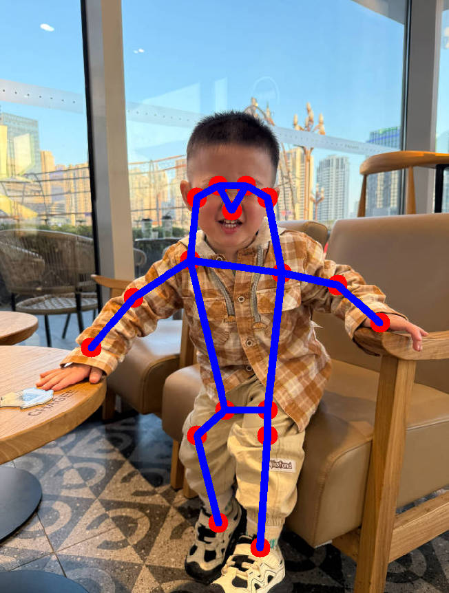

# Samples HR pose  estimation

## Overview

The **sample_hrnet_pose_estimation** sample provides high-precision human pose estimation capabilities.
It processes input images and publishes the following ROS 2 topics:

- **`/pose_estimation_results`**: Output images with visualized pose keypoints.
- **`/pose_estimation_points`**: Raw keypoint coordinates in a structured message format.

For more information, please refer to [sample_hrnet_pose_estimation](https://github.com/qualcomm-qrb-ros/qrb_ros_samples/tree/main/ai_vision/sample_hrnet_pose_estimation).




## Pipeline flow


## Supported Platforms

| Hardware               | Software                        |
| ---------------------- | ------------------------------- |
| IQ-9075 Evaluation Kit | Qualcomm Linux, Qualcomm Ubuntu |

## ROS Nodes Used


| ROS Node         | Description                                                  |
| ---------------- | ------------------------------------------------------------ |
| `hrnet_pose_estimation_node` | Receive the `/image_raw` topic, perform pose detection on it, and publish the `pose_estimation_results` and `pose_estimation_points` topics. |
| `image_publisher_node` | image_publisher is a ros jazzy packages, can publish image ros topic with local path. For more detail, Please refer to [image_publisher](https://github.com/ros-perception/image_pipeline). |
|`qrb_ros_camera`| The QRB ROS Camera is a ROS package to publish the images from Qualcomm CSI and GMSL cameras. For more detail, Please refer to [QRB ROS CAMERA](https://github.com/qualcomm-qrb-ros/qrb_ros_camera).|
|`qrb_ros_nn_inference`| QRB_ROS_NN_inference is a ROS2 package for performing neural network model, providing AI-based perception for robotics applications. For more detail, Please refer to [QRB ROS NN Inference](https://github.com/qualcomm-qrb-ros/qrb_ros_nn_inference). |

## ROS Topics Used


| ROS Topic | Type                         | Published By     |
| --------- | ---------------------------- | ---------------- |
| `/pose_estimation_results`  | `sensor_msgs.msg.Image` | `hrnet_pose_estimation_node` |
|`/pose_estimation_points`| `geometry_msgs.msg.PolygonStamped` | `hrnet_pose_estimation_node` |
| `/image_raw` | `sensor_msgs.msg.Image` | `image_publisher_node` ` qrb_ros_camera` |
| `/qrb_inference_input_tensor` | `qrb_ros_tensor_list_msgs.msg.TensorList` | `hrnet_pose_estimation_node` |
| `/qrb_inference_output_tensor` | `qrb_ros_tensor_list_msgs.msg.TensorList` | `qrb_ros_nn_inference` |

Note:`/pose_estimation_points` contains the coordinates of 17 key points on the original image. Developers can subscribe to this topic for secondary development. Key points include: nose, left eye, right eye, etc. The specific correspondence is as follows: 

| ID  | Body Part      | ID  | Body Part      |
|-----|----------------|-----|----------------|
| 1   | Nose           | 10  | Right Wrist    |
| 2   | Right Eye      | 11  | Left Wrist     |
| 3   | Left Eye       | 12  | Right Hip      |
| 4   | Right Ear      | 13  | Left Hip       |
| 5   | Left Ear       | 14  | Right Knee     |
| 6   | Right Shoulder | 15  | Left Knee      |
| 7   | Left Shoulder  | 16  | Right Ankle    |
| 8   | Right Elbow    | 17  | Left Ankle     |
| 9   | Left Elbow     |     |                |

## Use cases on QCLINUX

### Prerequisites
- Please refer to [Settings](https://docs.qualcomm.com/bundle/publicresource/topics/80-70020-265/quick_start.html?vproduct=1601111740013072&version=1.5&facet=Qualcomm%20Intelligent%20Robotics%20SDK#set-up-the-environment-for-running-sample-applications) to complete the device and host setup.

### Out of box usage
Login to the device, please use the command `ssh root@[ip-addr]`

**Step 1: Install sample package and model package**

```bash
# Remount the /usr directory with read-write permissions
(ssh) mount -o remount rw /usr

# Install sample package and model package
(ssh) tar --no-same-owner -zxf /opt/sample_hrnet_pose_estimation.tar.gz -C /usr/
```

**Step 2: Setup runtime environment**

```
# Set HOME variable
(ssh) export HOME=/opt

# set SELinux to permissive mode
(ssh) setenforce 0

# setup runtime environment
(ssh) source /usr/share/qirp-setup.sh -m
```

**Step 3: Run sample**

```
# Launch the sample with local image, You can replace 'image_path' with the path to your desired image.
ros2 launch sample_hrnet_pose_estimation launch_with_image_publisher.py image_path:=/usr/share/sample_hrnet_pose_estimation/input_image.jpg

# Additionally, you can run the following command to see the pose estimation in real time.
ros2 launch sample_hrnet_pose_estimation launch_with_qrb_ros_camera.py
```

### On Host

```
source /opt/ros/jazzy/setup.bash
rqt
```

After startup `rqt`, Click the following button.

```
Plugins --> Visualization --> Image View
```

Then, select  `pose_estimation_results` to see the result image.

Besides, You can run the follow command to view key_points.

```
ros topic echo /pose_estimation_points
```


### Build and Run

**Step 1: Build sample project**

On the host machine, move to the artifacts directory and decompress the package using the `tar` command.

```bash
# Set up qir sdk environment
tar -zxf qirp-sdk_<qirp_version>.tar.gz
cd <qirp_decompressed_path>/qirp-sdk
source setup.sh

# build sample
cd <qirp_decompressed_path>/qirp-samples/ai_vision/sample_hrnet_pose_estimation
colcon build
```

**Step 2: Package and push sample to device**

```bash
# package and push build result of sample
cd <qirp_decompressed_path>/qirp-samples/ai_vision/sample_hrnet_pose_estimation/install/sample_hrnet_pose_estimation
tar -czvf sample_hrnet_pose_estimation.tar.gz lib share
scp sample_hrnet_pose_estimation.tar.gz root@[ip-addr]:/opt/
```

**Step3 : Run the sample**

Please refer to [Out of box usage](###Out of box usage).

## Use cases on Ubuntu

### Prerequisites

### Out of box usage


### Build and Compile