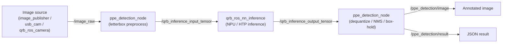

<div>
  <h1>AI Sample PPE Detection</h1>
  <p align="center">
  </p>
</div>


---

## 👋 Overview

- This sample detects **PPE (Personal Protective Equipment)** — currently **helmet** and **vest** — from an input image or video stream. It bridges an incoming `/image_raw` (`sensor_msgs/Image`) topic to the QRB ROS NN Inference node, runs the model on the Qualcomm **NPU (HTP)** via QNN, and publishes annotated detection results.
- The model is a **Gear Guard Net** detection model, provided as a precompiled **QNN context binary** (`gear_guard_net_ctx.bin`). The sample performs letterbox preprocessing, sends the tensor to `qrb_ros_nn_inference`, then post-processes the output tensors (dequantize → confidence filter → per-class NMS) and publishes an annotated image on `/ppe_detection/image` plus a JSON result on `/ppe_detection/result`.



| Node Name | Function |
| --------- | -------- |
| image publisher | Publishes a local image file to a ROS topic at a fixed rate. |
| usb_cam | Captures frames from a live USB (V4L2) camera and publishes them to `/image_raw`. |
| [qrb ros camera](https://github.com/qualcomm-qrb-ros/qrb_ros_camera) | Captures frames from a GMSL camera and publishes them to `/cam<camera_id>_<stream_name>`. |
| sample ppe detection | Subscribes to input images for letterbox preprocessing, sends tensors to the NN inference node, then post-processes (dequantize / NMS / box-hold) and publishes annotated results. |
| [qrb ros nn interface](https://github.com/qualcomm-qrb-ros/qrb_ros_nn_inference) | Loads a trained AI model, receives preprocessed images, performs inference on the NPU, and publishes output tensors. |

## 🔎 Table of contents

- [👋 Overview](#-overview)
- [🔎 Table of contents](#-table-of-contents)
- [⚓ Used ROS Topics](#-used-ros-topics)
- [🎯 Supported targets](#-supported-targets)
- [✨ Installation](#-installation)
- [🚀 Usage](#-usage)
  - [Prerequisites](#-prerequisites)
  - [Build from source](#-build-from-source)
- [Visualization](#-visualization)
- [🤝 Contributing](#-contributing)
- [❤️ Contributors](#️-contributors)
- [❔ FAQs](#-faqs)
- [📜 License](#-license)

## ⚓ Used ROS Topics

| ROS Topic | Type | Description |
| --------- | ---- | ----------- |
| `/image_raw` | `<sensor_msgs.msg.Image>` | Input image / video frame. When `camera_type:=gmsl`, this is remapped from `qrb_ros_camera`'s `/cam<camera_id>_<stream_name>`. |
| `/qrb_inference_input_tensor` | `<qrb_ros_tensor_list_msgs.msg.TensorList>` | Preprocessed (letterboxed, NHWC uint8) input tensor |
| `/qrb_inference_output_tensor` | `<qrb_ros_tensor_list_msgs.msg.TensorList>` | Raw model output tensors (`boxes`, `scores`, `class_idx`) |
| `/ppe_detection/image` | `<sensor_msgs.msg.Image>` | Annotated image with drawn bounding boxes |
| `/ppe_detection/result` | `<std_msgs.msg.String>` | JSON detection result (`count` + per-box `label` / `score` / `box`) |

## 🎯 Supported targets

<table>
  <tr>
    <th>Development Hardware</th>
    <th>Hardware Overview</th>
  </tr>
  <tr>
    <td>Qualcomm Dragonwing™ IQ-9075 EVK</td>
    <td>
      <a href="https://www.qualcomm.com/products/internet-of-things/industrial-processors/iq9-series/iq-9075">
        
      </a>
    </td>
  </tr>
  <tr>
    <td>Qualcomm Dragonwing™ IQ-8275 EVK</td>
    <td>
      <a href="https://www.qualcomm.com/internet-of-things/products/iq8-series/iq-8275">
        
      </a>
    </td>
  </tr>
  <tr>
    <th>GMSL Camera Support</th>
    <td>LI-VENUS-OX03F10-OAX40-GM2A-118H(YUV)</td>
    <td>LI-VENUS-OX03F10-OAX40-GM2A-118H(YUV)</td>
  </tr>
</table>

## ✨ Installation

> [!IMPORTANT]
> The following steps need to be run on **Qualcomm Ubuntu** and **ROS Jazzy**.<br>
> Refer to [Install Ubuntu on Qualcomm IoT Platforms](https://ubuntu.com/download/qualcomm-iot) and [Install ROS Jazzy](https://docs.ros.org/en/jazzy/index.html) to setup environment. <br>
> For Qualcomm Linux, please check out the [Qualcomm Intelligent Robotics Product SDK](https://docs.qualcomm.com/bundle/publicresource/topics/80-70018-265/introduction_1.html?vproduct=1601111740013072&version=1.4&facet=Qualcomm%20Intelligent%20Robotics%20Product%20(QIRP)%20SDK) documents.

- Build the sample from source. See [Prerequisites](#-prerequisites) and [Build from source](#-build-from-source) below.

## 🚀 Usage

### 🔧 Prerequisites

- Add qcom ppa repository source:
```bash
sudo add-apt-repository ppa:ubuntu-qcom-iot/qcom-ppa
sudo add-apt-repository ppa:ubuntu-qcom-iot/qirp
sudo apt update
```

- Install QRB ROS packages:
```bash
sudo apt install -y ros-jazzy-qrb-ros-nn-inference ros-jazzy-qrb-ros-tensor-list-msgs ros-jazzy-image-publisher ros-jazzy-usb-cam
sudo apt install -y ros-dev-tools
sudo rosdep init
rosdep update
```

- Download the precompiled **Gear Guard Net** QNN DLC from [Qualcomm AI Hub](https://aihub.qualcomm.com/models/gear_guard_net) (detects **helmet / vest**, `320x192` HxW RGB input). The release asset is hosted publicly, so **no API token is required**:
```bash
cd /tmp
curl -fLO https://qaihub-public-assets.s3.us-west-2.amazonaws.com/qai-hub-models/models/gear_guard_net/releases/v0.61.0/gear_guard_net-qnn_dlc-w8a8.zip
python3 -m zipfile -e gear_guard_net-qnn_dlc-w8a8.zip .
# -> /tmp/gear_guard_net-qnn_dlc-w8a8/gear_guard_net.dlc
```
> Alternatively, export the DLC yourself with an AI Hub account (requires an API token):
> `pip install "qai-hub-models[gear-guard-net]"` → `qai-hub configure --api_token <TOKEN>` →
> `python -m qai_hub_models.models.gear_guard_net.export --target-runtime qnn_dlc --device "<your target device>"`
> (run `qai-hub list-devices` for valid `--device` names; the DLC is written under `build/`).

- Set up the QAIRT environment following the [QAIRT general setup guide](https://docs.qualcomm.com/doc/80-63442-10/topic/general_setup.html).

- Convert the DLC to a **QNN context binary**. The node loads `/opt/model/gear_guard_net_ctx.bin` by default. The context binary is tied to a specific HTP backend, so regenerate it on / for each target platform:
```bash
sudo mkdir -p /opt/model
qnn-context-binary-generator \
    --backend /usr/lib/libQnnHtp.so \
    --model /usr/lib/libQnnModelDlc.so \
    --dlc_path /tmp/gear_guard_net-qnn_dlc-w8a8/gear_guard_net.dlc \
    --binary_file gear_guard_net_ctx \
    --output_dir /opt/model
```

<details>
  <summary>Debian package usage details</summary>

> [!IMPORTANT]
> The model must be a **precompiled QNN context binary** (`.bin`), **NOT** the raw `.dlc` file. The default model path is `/opt/model/gear_guard_net_ctx.bin`. See [Prerequisites](#-prerequisites) for how to obtain / convert it.

- Run PPE detection on a single image:
```bash
source /opt/ros/jazzy/setup.bash
ros2 launch sample_ppe_detection launch_with_image_publisher.py
```

- You can replace this with a custom image file or model path:
```bash
ros2 launch sample_ppe_detection launch_with_image_publisher.py image_path:=<your local image path> model_path:=<your local model path>
```

- To run PPE detection from a **live USB (V4L2) camera** (recommended for real cameras — exposes resolution / frame rate / pixel format controls), install the USB camera driver and launch:
```bash
sudo apt install -y ros-jazzy-usb-cam
ros2 launch sample_ppe_detection launch_with_camera.py camera_type:=usb video_device:=/dev/video0
```

> **Note:** `camera_type:=usb` is the default. Defaults are `640x480 @ 30`, `pixel_format:=yuyv2rgb` (widest webcam compatibility). For a 720p/1080p webcam use MJPEG, e.g. `ros2 launch sample_ppe_detection launch_with_camera.py image_width:=1280 image_height:=720 pixel_format:=mjpeg2rgb`. The node self-throttles to NPU speed and drops surplus frames.

- To run PPE detection from a **GMSL camera** via [qrb_ros_camera](https://github.com/qualcomm-qrb-ros/qrb_ros_camera), install the driver and launch:
```bash
sudo apt install -y ros-jazzy-qrb-ros-camera
ros2 launch sample_ppe_detection launch_with_camera.py camera_type:=gmsl
```

> **Note:** Defaults are `640x480 @ 30` on `camera_id:=0`, using `camera_info_file:=camera_info_OX03F10_yuv.yaml` (matches the `LI-VENUS-OX03F10-OAX40-GM2A-118H(YUV)` module in [Supported targets](#-supported-targets)) from the `qrb_ros_camera` share directory. `qrb_ros_camera` also ships `camera_info_{imx577,ov9282,ar0231,OX03F10_bayer}.yaml`; override `camera_info_file` if you're using a different GMSL module.

</details>

### 🔨 Build from source

- Download source code from the qrb-ros-sample repository:
```bash
mkdir -p ~/qrb_ros_sample_ws/src && cd ~/qrb_ros_sample_ws/src
git clone -b jazzy-rel https://github.com/qualcomm-qrb-ros/qrb_ros_samples.git
```

- Build the sample from source code:
```bash
cd ~/qrb_ros_sample_ws/src/qrb_ros_samples/ai_vision/sample_ppe_detection

rosdep install --from-paths . --ignore-src --rosdistro jazzy -y --skip-keys "qrb_ros_nn_inference qrb_ros_tensor_list_msgs"
source /opt/ros/jazzy/setup.bash
colcon build
source install/setup.bash
```

- Run PPE detection on a single image:
```bash
source /opt/ros/jazzy/setup.bash
ros2 launch sample_ppe_detection launch_with_image_publisher.py
```

- You can replace this with a custom image file or model path:
```bash
ros2 launch sample_ppe_detection launch_with_image_publisher.py image_path:=<your local image path> model_path:=<your local model path>
```

- You can also run PPE detection from a live USB (V4L2) camera:
```bash
sudo apt install -y ros-jazzy-usb-cam
ros2 launch sample_ppe_detection launch_with_camera.py camera_type:=usb video_device:=/dev/video0
```

- Or from a GMSL camera via qrb_ros_camera:
```bash
sudo apt install -y ros-jazzy-qrb-ros-camera
ros2 launch sample_ppe_detection launch_with_camera.py camera_type:=gmsl
```

## 📊 Visualization

- You can then check the ROS topic `/ppe_detection/image` in rqt.
Please refer to the [ROS 2 Jazzy documentation](https://docs.ros.org/en/jazzy/Tutorials/Beginner-CLI-Tools/Introducing-Turtlesim/Introducing-Turtlesim.html) to install rqt.

- Alternatively, inspect the JSON result directly from the command line:
```bash
source /opt/ros/jazzy/setup.bash
ros2 topic echo /ppe_detection/result
```

## 🤝 Contributing

We love community contributions! Feel free to create an issue for bug reports, feature requests, or any discussion 💡.

## ❤️ Contributors

Thanks to all our contributors who have helped make this project better!

<table>
  <tr>
    <td style="text-align: center;">
      <a href="https://github.com/hangshen">
        
        <br />
        <sub><b>Hang Shen</b></sub>
      </a>
    </td>
  </tr>
</table>


## ❔ FAQs

<details>
<summary>Why is the publish rate so low (1~3 Hz)?</summary><br>
NPU (HTP) inference is serial — one frame is processed at a time. Publishing faster than the NPU can consume just causes frame drops (the node warns and skips frames while a previous frame is still being processed). Keep the publish rate low to match actual inference throughput.
</details>

<details>
<summary>Detections flicker between frames. How can I stabilize them?</summary><br>
The node includes a temporal "box-hold" mechanism: if a class is missed in the current frame, it reuses the most recent detected box for up to <code>box_hold_frames</code> frames. Increase this value (via <code>launch_with_camera.py</code>) to hold boxes longer, or set it to <code>0</code> to disable.
</details>

<details>
<summary><code>ERROR: Model format NOT support!</code> when loading the inference node</summary><br>
<code>nn_inference_node</code> loads a <b>precompiled context binary</b> only; on-the-fly <code>.dlc</code> compilation is not supported. Convert the model to a <code>.bin</code> context binary first (see <a href="#-prerequisites">Prerequisites</a>). The <code>.bin</code> is tied to a specific backend (HTP version) and must be regenerated for every new model or hardware platform.
</details>


## 📜 License

Project is licensed under the [BSD-3-Clause-Clear](https://spdx.org/licenses/BSD-3-Clause-Clear.html) License. See [LICENSE](./LICENSE) for the full license text.
