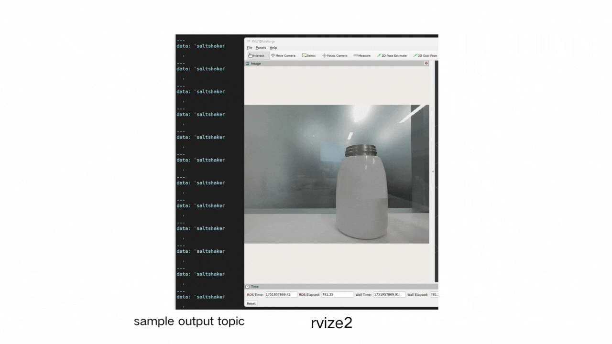

<div >
  <h1>AI Sample Resnet101</h1>
  <p align="center">
</div>



---

## 👋 Overview

The `sample_resnet101` is a Python-based ROS node that performs image classification using QNN-based inference.

[ResNet101](https://huggingface.co/qualcomm/ResNet101) is a machine learning model that can classify images from the Imagenet dataset. It can also be used as a backbone in building more complex models for specific use cases.


| Node Name                                                    | Function                                                     |
| ------------------------------------------------------------ | ------------------------------------------------------------ |
| [qrb ros camera](https://github.com/qualcomm-qrb-ros/qrb_ros_camera) | Qualcomm ROS 2 package that captures images with parameters and publishes them to ROS topics. |
| image publisher                                              | Publishes image data to a ROS topic—can be camera frames, local files, or processed outputs. |
| image classification preprocess                              | Subscribes to image data, reshapes/resizes it, and republishes it to a downstream topic. |
| [qrb ros nn interface](https://github.com/qualcomm-qrb-ros/qrb_ros_nn_inference) | Loads a trained AI model, receives preprocessed images, performs inference, and publishes results. |
| image classification postprocess                             | Matches inference output with label files and converts results into human-readable form. |

## 🔎 Table of contents

  * [Used ROS Topics](#-apis)
  * [Supported targets](#-supported-targets)
  * [Installation](#-installation)
  * [Usage](#-usage)
  * [Build from source](#-build-from-source)
  * [Contributing](#-contributing)
  * [Contributors](#%EF%B8%8F-contributors)
  * [FAQs](#-faqs)
  * [License](#-license)

## ⚓ Used ROS Topics 

| ROS Topic                       | Type                                          | Description                    |
| ------------------------------- | --------------------------------------------- | ------------------------------ |
| `/image_raw `                   | `< sensor_msgs.msg.Image> `                   | public image info              |
| `/qrb_inference_input_tensor `  | `< qrb_ros_tensor_list_msgs/msg/TensorList> ` | preprocess message             |
| `/qrb_inference_output_tensor ` | `< qrb_ros_tensor_list_msgs/msg/TensorList> ` | nn interface result with model |
| `/resnet101_results `           | `< sensor_msgs.msg.String> `                  | model output label             |

## 🎯 Supported targets

<table >
  <tr>
    <th>Development Hardware</th>
     <td>Qualcomm Dragonwing™ IQ-9075 EVK</td>
  </tr>
  <tr>
    <th>Hardware Overview</th>
    <th><a href="https://www.qualcomm.com/products/internet-of-things/industrial-processors/iq9-series/iq-9075"></a></th>
  </tr>
  <tr>
    <th>GMSL Camera Support</th>
    <td>LI-VENUS-OX03F10-OAX40-GM2A-118H(YUV)</td>
  </tr>
</table>


## ✨ Installation

> [!IMPORTANT]
> **PREREQUISITES**: The following steps need to be run on **Qualcomm Ubuntu** and **ROS Jazzy**.<br>
> Reference [Install Ubuntu on Qualcomm IoT Platforms](https://ubuntu.com/download/qualcomm-iot) and [Install ROS Jazzy](https://docs.ros.org/en/jazzy/index.html) to setup environment. <br>
> For Qualcomm Linux, please check out the [Qualcomm Intelligent Robotics Product SDK](https://docs.qualcomm.com/bundle/publicresource/topics/80-70018-265/introduction_1.html?vproduct=1601111740013072&version=1.4&facet=Qualcomm%20Intelligent%20Robotics%20Product%20(QIRP)%20SDK) documents.

Add Qualcomm IOT PPA for Ubuntu:

```bash
sudo add-apt-repository ppa:ubuntu-qcom-iot/qcom-noble-ppa
sudo add-apt-repository ppa:ubuntu-qcom-iot/qirp
sudo apt update
```

Install Debian package:

```bash
sudo apt install ros-jazzy-sample-resnet101
```

## 🚀 Usage

<details>
  <summary>Usage details</summary>

```bash
source /opt/ros/jazzy/setup.bash
ros2 launch sample_resnet101 launch_with_image_publisher.py
or # You can also replace this with a custom image file
ros2 launch sample_resnet101 launch_with_image_publisher.py image_path:=/usr/share/sample_resnet101_quantized/cup.jpg
or # You can launch with qrb ros camera
ros2 launch sample_resnet101 launch_with_qrb_ros_camera.py
```

When using this launch script, it will use the default parameters:

```py
DeclareLaunchArgument(
'image_path',
default_value=os.path.join(package_path, 'glasses.jpg'),
description='Path to the image file'
)

# Node for image_publisher
image_publisher_node = Node(
package='image_publisher',  
executable='image_publisher_node', 
namespace=namespace,
name='image_publisher_node', 
output='screen', 
parameters=[
{'filename': image_path},  
{'rate': 10.0},  # Set the publishing rate to 10 Hz
]
)
```

It will send local glasses.jpg file, and outputs image at `10` Hz. 

The output for these commands:

```
[INFO] [launch]: All log files can be found below /opt/.ros/log/1970-01-06-06-29-52-108238-qcs9075-iq-9075-evk-632119
[INFO] [launch]: Default logging verbosity is set to INFO
[INFO] [image_publisher_node-1]: process started with pid [632154]
[INFO] [qrb_ros_resnet101-2]: process started with pid [632155]
[INFO] [component_container-3]: process started with pid [632156]
[INFO] [qrb_ros_resnet101_posprocess-4]: process started with pid [632157]
[image_publisher_node-1] [INFO] [0000455392.470308424] [image_publisher_node]: Reset filename as '/usr/share/sample_resnet101/glasses.jpg'
[image_publisher_node-1] [INFO] [0000455392.470388059] [image_publisher_node]: File name for publishing image is: /usr/share/sample_resnet101/glasses.jpg
[image_publisher_node-1] [INFO] [0000455392.472134934] [image_publisher_node]: Flip horizontal image is: false
[image_publisher_node-1] [INFO] [0000455392.472192642] [image_publisher_node]: Flip flip_vertical image is: false
[image_publisher_node-1] [INFO] [0000455392.472981236] [image_publisher_node]: no camera_info_url exist
[component_container-3] [INFO] [0000455392.608793059] [container]: Load Library: /usr/lib/libqrb_ros_inference_node.so
[component_container-3] [INFO] [0000455392.614030976] [container]: Found class: rclcpp_components::NodeFactoryTemplate<qrb_ros::nn_inference::QrbRosInferenceNode>
[component_container-3] [INFO] [0000455392.614125194] [container]: Instantiate class: rclcpp_components::NodeFactoryTemplate<qrb_ros::nn_inference::QrbRosInferenceNode>
[component_container-3] [QRB INFO] Loading model from binary file: /opt/model/ResNet101_w8a8.bin
[component_container-3] [QRB INFO] /usr/lib/libQnnHtp.so initialize successfully
[component_container-3] /prj/qct/webtech_scratch20/mlg_user_admin/qaisw_source_repo/rel/qairt-2.34.0/release/snpe_src/avante-tools/prebuilt/dsp/hexagon-sdk-5.4.0/ipc/fastrpc/rpcmem/src/rpcmem_android.c:38:dummy call to rpcmem_init, rpcmem APIs will be used from libxdsprpc
[component_container-3] [QRB INFO] Qnn device initialize successfully
[component_container-3] [QRB INFO] Initialize Qnn graph from binary file successfully
[component_container-3] [INFO] [0000455392.796449621] [nn_inference_node]: Inference init successfully!
[INFO] [launch_ros.actions.load_composable_nodes]: Loaded node '/nn_inference_node' in container '/container'
[qrb_ros_resnet101_posprocess-4] [INFO] [0000455393.048110246] [resnet101_postprocess_node]: Initial ROS Node resnet101
[qrb_ros_resnet101_posprocess-4] [INFO] [0000455393.049362434] [resnet101_postprocess_node]: model path: /opt/model/
[qrb_ros_resnet101-2] [INFO] [0000455393.063010350] [resnet101_node]: Initial ROS Node resnet101
[component_container-3] [INFO] [0000455393.078229621] [nn_inference_node]: Got model input data, start executing inference...

```

Then you can check ROS topics with the name`/resnet101_output` in other shell terminal

```bash
ros2 topic echo /resnet101_output
data: 'sunglass

  '
```

</details>

## 👨‍💻 Build from source

<details>
  <summary>Build from source details</summary>

Install dependencies

```
sudo apt install ros-jazzy-rclpy \
  ros-jazzy-sensor-msgs \
  ros-jazzy-std-msgs \
  ros-jazzy-cv-bridge \
  ros-jazzy-ament-index-python \
  ros-jazzy-qrb-ros-tensor-list-msgs \
  python3-opencv \
  python3-numpy \
  ros-jazzy-image-publisher \
  ros-jazzy-qrb-ros-nn-inference \
  ros-jazzy-qrb-ros-camera \
  ros-jazzy-image-publisher
```

Download the source code and build with colcon

```bash
source /opt/ros/jazzy/setup.bash
git clone https://github.com/qualcomm-qrb-ros/qrb_ros_samples.git
cd ai_vision/sample_resnet101
colcon build
```

Run and debug

```bash
source install/setup.bash
ros2 launch sample_resnet101 launch_with_image_publisher.py
```

</details>

## 🤝 Contributing

We love community contributions! Get started by reading our [CONTRIBUTING.md](CONTRIBUTING.md).<br>
Feel free to create an issue for bug report, feature requests or any discussion💡.

## ❤️ Contributors

Thanks to all our contributors who have helped make this project better!

<table>
  <tr>
    <td align="center"><a href="https://github.com/quic-fulan"><br /><sub><b>quic-fulan</b></sub></a></td>
  </tr>
</table>


## ❔ FAQs

<details>
<summary>Why only output text result?</summary><br>
Post-processed text output is useful for integration into other ROS-based demo samples.
</details>


## 📜 License

Project is licensed under the [BSD-3-Clause](https://spdx.org/licenses/BSD-3-Clause.html) License. See [LICENSE](./LICENSE) for the full license text.