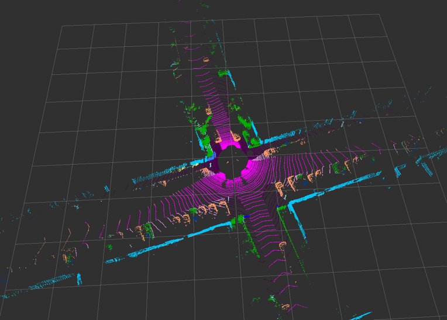
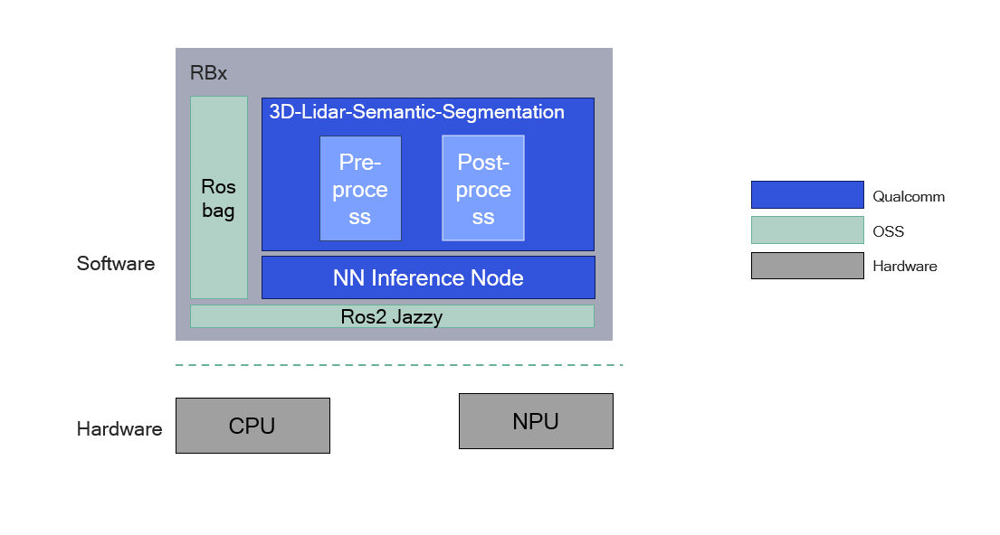
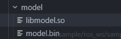

<!-- # Copyright (c) Qualcomm Technologies, Inc. and/or its subsidiaries.
# SPDX-License-Identifier: BSD-3-Clause-Clear -->

<div >
  <h1>Sample 3D LiDAR Semantic Segmentation</h1>
  <p align="center">
</div>



---

## 👋 Overview

The **sample_3d_lidar_semantic_segmentation** sample provides real-time semantic segmentation capabilities for 3D LiDAR point clouds.
It processes input point clouds and publishes the following ROS 2 topics:

- **`/semantic_points`**: Semantic point cloud with RGB class colors.

For model information, please refer to [SalsaNext - Qualcomm AI Hub](https://aihub.qualcomm.com/iot/models/salsanext?searchTerm=salsanext)




| Node Name                                                    | Function                                                     |
| ------------------------------------------------------------ | ------------------------------------------------------------ |
| `lidar_semantic_segmentation_node` | The node subscribes to /velodyne_points, performs preprocess and postprocess for SalsaNext semantic segmentation, and publishes results to /semantic_points. |
|`qrb_ros_nn_inference`| QRB_ROS_NN_inference is a ROS2 package for performing neural network model inference and AI-based perception. For more detail, Please refer to [QRB ROS NN Inference](https://github.com/qualcomm-qrb-ros/qrb_ros_nn_inference). |


## 🔎 Table of contents

  * [Used ROS Topics](#-used-ros-topics)
  * [Supported targets](#-supported-targets)
  * [Installation](#-installation)
  * [Usage](#-usage)
  * [Build from source](#-build-from-source)
  * [Contributing](#-contributing)
  * [Contributors](#%EF%B8%8F-contributors)
  * [FAQs](#-faqs)
  * [License](#-license)

## ⚓ Used ROS Topics 

| ROS Topic                       | Type                                       | Description                                                  |
| ------------------------------- | ------------------------------------------ | ------------------------------------------------------------ |
| `/velodyne_points `             | `sensor_msgs/msg/PointCloud2 `             | Input raw LiDAR point cloud topic.                           |
| `/qrb_inference_input_tensor `  | `qrb_ros_tensor_list_msgs/msg/TensorList ` | The preprocessed point cloud is converted into an input tensor for nn inference. |
| `/qrb_inference_output_tensor ` | `qrb_ros_tensor_list_msgs/msg/TensorList ` | Output tensor message from nn inference.                     |
| `/semantic_points`              | `sensor_msgs/msg/PointCloud2`              | Output semantic point cloud with packed RGB colors.          |

Note: `/semantic_points` keeps original points and attaches semantic color labels from SalsaNext predictions. The class IDs follow the 20-class setup:

| Class ID | Category         | Class ID | Category         |
|----------|------------------|----------|------------------|
| 0        | unlabeled        | 10       | parking          |
| 1        | car              | 11       | sidewalk         |
| 2        | bicycle          | 12       | other-ground     |
| 3        | motorcycle       | 13       | building         |
| 4        | truck            | 14       | fence            |
| 5        | other-vehicle    | 15       | vegetation       |
| 6        | person           | 16       | trunk            |
| 7        | bicyclist        | 17       | terrain          |
| 8        | motorcyclist     | 18       | pole             |
| 9        | road             | 19       | traffic-sign     |

## 🎯 Supported targets

<table >
  <tr>
    <th>Development Hardware</th>
     <td>Qualcomm Dragonwing™ IQ-9075 EVK</td>
  </tr>
  <tr>
    <th>Hardware Overview</th>
    <th><a href="https://www.qualcomm.com/products/internet-of-things/industrial-processors/iq9-series/iq-9075"></a></th>
  </tr>
</table>


## ✨ Installation

> [!IMPORTANT]
> **PREREQUISITES**: The following steps need to be run on **Qualcomm Ubuntu** and **ROS Jazzy**.<br>
> Reference [Install Ubuntu on Qualcomm IoT Platforms](https://ubuntu.com/download/qualcomm-iot) and [Install ROS Jazzy](https://docs.ros.org/en/jazzy/index.html) to setup environment. <br>
> For Qualcomm Linux, please check out the [Qualcomm Intelligent Robotics Product SDK](https://docs.qualcomm.com/bundle/publicresource/topics/80-70018-265/introduction_1.html?vproduct=1601111740013072&version=1.4&facet=Qualcomm%20Intelligent%20Robotics%20Product%20(QIRP)%20SDK) documents.

Add Qualcomm IOT PPA for Ubuntu:

```bash
sudo add-apt-repository ppa:ubuntu-qcom-iot/qcom-ppa
sudo add-apt-repository ppa:ubuntu-qcom-iot/qirp
sudo apt update
```

## 🚀 Usage

<details>
  <summary>Usage details</summary>

1. Install QRB ROS packages:
```bash
sudo apt install -y ros-jazzy-qrb-ros-nn-inference ros-jazzy-qrb-ros-tensor-list-msgs
sudo apt install -y ros-dev-tools
sudo rosdep init
rosdep update
```

2.  Download source code from qrb-ros-sample repository.
```bash
mkdir -p ~/qrb_ros_sample_ws/src && cd ~/qrb_ros_sample_ws/src
git clone https://github.com/qualcomm-qrb-ros/qrb_ros_samples.git
```

3. Build sample from source code.
```bash
cd ~/qrb_ros_sample_ws/src/qrb_ros_samples/robotics/sample_3d_lidar_semantic_segmentation
rosdep install --from-paths . --ignore-src --rosdistro jazzy -y --skip-keys "qrb_ros_tensor_list_msgs qrb_ros_nn_inference"
source /opt/ros/jazzy/setup.bash
colcon build
source install/setup.bash
```
4. Prepare model files on host

```
wget https://qaihub-public-assets.s3.us-west-2.amazonaws.com/qai-hub-models/models/salsanext/releases/v0.50.2/salsanext-tflite-float.zip
unzip salsanext-tflite-float.zip
```

5. Prepare your x86 host and convert the model for HTP acceleration.

Please follow the QNN SDK setup guide on host:
[QNN SDK](https://docs.qualcomm.com/nav/home/linux_setup.html?product=1601111740010412#step-1-install-qualcomm-ai-engine-direct-aka-the-qnn-sdk-)

Complete the following steps in that guide:
- Step 1: Install Qualcomm AI Engine Direct (QNN SDK)
- Step 2: Install QNN SDK dependencies
- Step 3: Install model frameworks

Use the following command to convert the TFLite model to a QNN-supported model:
```
qnn-tflite-converter --input_network <unzip_path>/salsanext-tflite-float/salsanext.tflite  --input_dim "lidar" 1,64,2048,5 --output_path <unzip_path>/salsanext-tflite-float/model.cpp --preserve_io datatype
```

6. Cross-compiling QNN model shared library

Open a new terminal and install the cross-compilation toolchain. 

```
sudo apt install g++-aarch64-linux-gnu
```

Generate model runtime library:

```
export QNN_AARCH64_UBUNTU_GCC_94=/
qnn-model-lib-generator -c <unzip_path>/salsanext-tflite-float/model.cpp -b <unzip_path>/salsanext-tflite-float/model.bin -o <unzip_path>/salsanext-tflite-float/ -t "aarch64-ubuntu-gcc9.4"
```

Copy `<output_path>/aarch64-oe-linux-gcc11.2/libmodel.so` and `<unzip_path>/salsanext-tflite-float/model.bin` to:
`<workspace>/sample_3d_lidar_semantic_segmentation/model` on device.



7. Publish the 3D lidar pointCloud.

```bash
cd <workspace>/sample_3d_lidar_semantic_segmentation/resource
tar -zxvf rosbag_3d_lidar_pointcloud.tar.gz
ros2 bag play <workspace>/sample_3d_lidar_semantic_segmentation/resource/rosbag_3d_lidar_pointcloud --loop
```

8. Open a new termial and run the sample on device

```bash
# setup runtime environment
source /opt/ros/jazzy/setup.bash
export ROS_DOMAIN_ID=222

# Launch the sample with default model path and FOV parameters.
ros2 launch sample_3d_lidar_semantic_segmentation launch.py \
  model_path:<workspace>/sample_3d_lidar_semantic_segmentation/model
 

```

9. Open a new terminal and use RViz2 to visualize topic `/semantic_points`.
```
source /opt/ros/jazzy/setup.bash
export ROS_DOMAIN_ID=222
rviz2
```

</details>

## 🤝 Contributing

We love community contributions! Get started by reading our [CONTRIBUTING.md](CONTRIBUTING.md).<br>
Feel free to create an issue for bug report, feature requests or any discussion💡.

## ❤️ Contributors

Thanks to all our contributors who have helped make this project better!

<table>
  <tr>
    <td align="center"><a href="https://github.com/Ceere"><br /><sub><b>Ceere</b></sub></a></td>
  </tr>
</table>


## ❔ FAQs

<details>
<summary>Does quantization significantly improve inference latency?</summary><br>
In our tests, the latency difference between the quantized and non-quantized versions of this model is not significant, so this README does not provide a dedicated quantization workflow.
If you have strict latency requirements, please refer to the <a href="https://www.qualcomm.com/developer/software/neural-processing-sdk-for-ai">Qualcomm Neural Processing SDK for AI</a> documentation to quantize the model before deployment.
</details>


## 📜 License

Project is licensed under the [BSD-3-Clause](https://spdx.org/licenses/BSD-3-Clause.html) License. See [LICENSE](../../LICENSE) for the full license text.