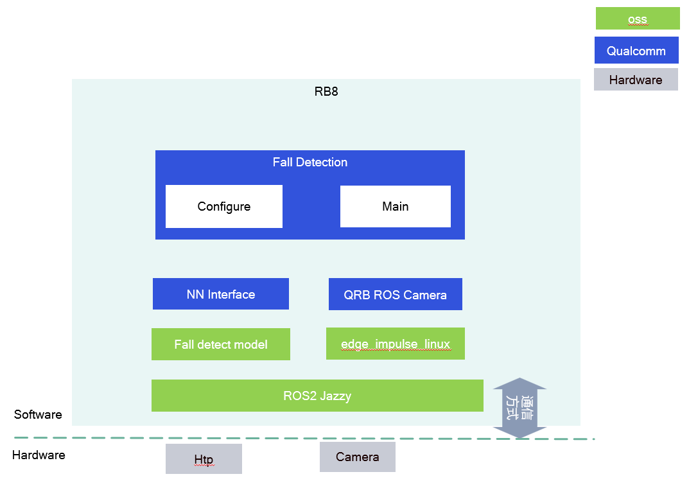

# Sample Fall Detection
<div align="center">
  
</div>
<div align="center">
  <a href="https://ubuntu.com/download/qualcomm-iot" target="_blank"></a>
  <a href="https://docs.ros.org/en/jazzy/" target="_blank"></a>
  <a href="https://edgeimpulse.com/" target="_blank"></a>
</div>


## 👋 Overview

The **Sample Fall Detection** package is a ROS 2 node that demonstrates real-time fall detection using Edge Impulse machine learning inference on Qualcomm platforms. This package integrates with the QRB ROS Camera to process video streams and detect fall events, making it suitable for elderly care, safety monitoring, and robotics applications.

<div align="center">
  
</div>

### Key Features

- **Real-time Fall Detection**: Uses Edge Impulse ML models for accurate fall detection
- **Camera Integration**: Seamlessly integrates with QRB ROS Camera for video input
- **Service Control**: Provides ROS services to enable/disable detection dynamically
- **Event Publishing**: Publishes fall detection events via ROS topics
- **Optimized Performance**: Leverages Qualcomm hardware acceleration for efficient inference

### Components

| Component | Description |
|-----------|-------------|
| `fall_detect_edge_impulse.py` | Main node that performs fall detection using Edge Impulse inference |
| `launch_with_qrb_ros_camera.py` | Launch file that starts both the camera node and fall detection node |

## 🔎 Table of Contents

- [Overview](#-overview)
- [Used ROS Topics](#-used-ros-topics)
- [Supported Targets](#-supported-targets)
- [Installation](#-installation)
- [Build from source](#-build-from-source)
- [Usage](#-usage)
- [Contributing](#-contributing)
- [Contributors](#️-contributors)
- [FAQs](#-faqs)
- [License](#-license)

## ⚓ Used ROS Topics

| Topic Name | Message Type | Publisher | Description |
|------------|--------------|-----------|-------------|
| `/camera/image_raw` | `sensor_msgs/Image` | QRB ROS Camera | Raw camera image input for fall detection |
| `/fall_detected` | `std_msgs/Bool` | Fall Detection Node | Publishes `True` when a fall is detected |

### Services

| Service Name | Service Type | Description |
|--------------|--------------|-------------|
| `/enable_fall_detection` | `std_srvs/SetBool` | Enable or disable fall detection processing |

## 🎯 Supported Targets

This package is designed to run on Qualcomm platforms with Ubuntu 24.04 and ROS Jazzy.

<table >
  <tr>
    <th>Development Hardware</th>
     <td>Qualcomm Dragonwing™ IQ-9075 EVK</td>
  </tr>
  <tr>
    <th>Hardware Overview</th>
    <th><a href="https://www.qualcomm.com/products/internet-of-things/industrial-processors/iq9-series/iq-9075"></a></th>
  </tr>
  <tr>
    <th>GMSL Camera Support</th>
    <td>LI-VENUS-OX03F10-OAX40-GM2A-118H(YUV)</td>
  </tr>
</table>

## ✨ Installation

> [!IMPORTANT]
> **PREREQUISITES**: The following steps need to be run on **Qualcomm Ubuntu 24.04** and **ROS Jazzy**.<br>
> Reference [Install Ubuntu on Qualcomm IoT Platforms](https://ubuntu.com/download/qualcomm-iot) and [Install ROS Jazzy](https://docs.ros.org/en/jazzy/index.html) to setup environment. <br>
> For Qualcomm Linux, please check out the [Qualcomm Intelligent Robotics Product SDK](https://docs.qualcomm.com/bundle/publicresource/topics/80-70018-265/introduction_1.html?vproduct=1601111740013072&version=1.4&facet=Qualcomm%20Intelligent%20Robotics%20Product%20(QIRP)%20SDK) documents.

### Step 1: Add Qualcomm IOT PPA

```bash
sudo add-apt-repository ppa:ubuntu-qcom-iot/qcom-ppa
sudo add-apt-repository ppa:ubuntu-qcom-iot/qirp
sudo apt update
```

### Step 2: Install QIRP SDK

The Sample Fall Detection package is included in the QIRP SDK. Install it with:

```bash
sudo apt install qirp-sdk
```

This will install all necessary dependencies including:
- QRB ROS Camera
- Edge Impulse runtime libraries
- OpenCV and CV Bridge
- All required ROS 2 packages

### Step 3: Source the ROS Environment

```bash
source /opt/ros/jazzy/setup.bash
```

### Step 4: Train model in Edge Impulse  and push model to device

Follow the guide in Edge Impulse [Profile - Projects - Edge Impulse](https://studio.edgeimpulse.com/studio/profile/projects?autoredirect=1&signature=e5708b1246b12bbc44963a119a31cae7adddb34fcdf5acafdada569fa2c88c23) to train model.

1. Train a model on Edge Impulse platform using own fall detection datasets. which collection from devices.
2. Export the model for Linux (ARM64), IQ9. 
3. after above steps, will download an .eim model in host machine
4. Push the .eim model to device default path /opt/model/


## 👨‍💻 Build from Source

<details>
<summary>Click to expand build instructions</summary>

### Prerequisites

Ensure you have the following dependencies installed:

```bash
# Install ROS 2 dependencies
sudo apt install ros-jazzy-cv-bridge ros-jazzy-sensor-msgs ros-jazzy-std-msgs ros-jazzy-std-srvs

# Install Python dependencies
sudo apt install python3-opencv python3-numpy

# Install QRB ROS Camera
sudo apt install ros-jazzy-qrb-ros-camera

# Install Edge Impulse SDK (if not already installed)
# Follow Edge Impulse documentation for your specific model
 python3 -m venv venv_qaihub
 source venv_qaihub/bin/activate
#will enter the python virtual env
 pip3 install edge_impulse_linux

```

### Clone and Build

1. Create a ROS 2 workspace:

```bash
mkdir -p ~/ros2_ws/src
cd ~/ros2_ws/src
```

2. Clone the repository:

```bash
git clone -b main --single-branch --depth 1 https://github.com/qualcomm-qrb-ros/qrb_ros_samples.git
```

3. Build the package:

```bash
cd ~/ros2_ws
colcon build --packages-select sample_fall_detection
```

4. Source the workspace:

```bash
source ~/ros2_ws/install/setup.bash
```

</details>

## 🚀 Usage

<details>
<summary>Click to expand usage instructions</summary>


### Launch Fall Detection with Camera

To start the fall detection node along with the QRB ROS Camera:

```bash
ros2 launch sample_fall_detection launch_with_qrb_ros_camera.py

#or launch with  qrb ros camera other supported camera

ros2 launch sample_fall_detection launch_with_qrb_ros_camera.py camera_info_file:=camera_info_xxx.yaml

```

This will:

1. Start the QRB ROS Camera node
2. Launch the fall detection node
3. Begin processing camera frames for fall detection

### Monitor Fall Detection Events

In a new terminal, subscribe to the fall detection topic:

```bash
ros2 topic echo /fall_detected
```

When a fall is detected, you will see:

```
data: true
---
```

### Enable/Disable Detection

You can dynamically enable or disable fall detection using the service:

**Disable detection:**

```bash
ros2 service call /enable_fall_detection std_srvs/srv/SetBool "{data: false}"
```

**Enable detection:**

```bash
ros2 service call /enable_fall_detection std_srvs/srv/SetBool "{data: true}"
```

### View Camera Stream

To visualize the camera stream:

```bash
ros2 run rqt_image_view rqt_image_view
```

Select `/camera/image_raw` from the dropdown menu.

</details>

## 🤝 Contributing

We welcome contributions to improve this package! Here's how you can help:

1. **Report Issues**: Found a bug or have a feature request? [Create an issue](https://github.com/qualcomm-qrb-ros/qrb_ros_samples/issues)
2. **Submit Pull Requests**: Have a fix or enhancement? Submit a PR!
3. **Improve Documentation**: Help us make the docs better

Please see [CONTRIBUTING.md](../../CONTRIBUTING.md) for detailed guidelines.

## ❤️ Contributors

<table>
  <tr>
    <td align="center">
      <a href="https://github.com/fulaliu">
        
        <br />
        <sub><b>Fulan Liu</b></sub>
      </a>
      <br />
      <sub>Maintainer</sub>
    </td>
  </tr>
</table>

## ❔ FAQs

<details>
<summary><b>Q: Can I use a different camera?</b></summary>

A: Yes! You can modify the `launch_with_qrb_ros_camera.py` file to configure different camera parameters. The QRB ROS Camera package supports various camera models. Update the `camera_info_config_file` and camera parameters accordingly.

</details>

<details>
<summary><b>Q: How can I adjust detection sensitivity?</b></summary>

A: Detection sensitivity depends on your Edge Impulse model's confidence threshold. You can adjust this in the node parameters or retrain your model with different thresholds on the Edge Impulse platform.

</details>

<details>
<summary><b>Q: The node is not detecting falls. What should I check?</b></summary>

A: Verify the following:
1. Camera is properly connected and publishing images: `ros2 topic echo /camera/image_raw`
2. Edge Impulse model is correctly loaded
3. Detection is enabled: `ros2 service call /enable_fall_detection std_srvs/srv/SetBool "{data: true}"`
4. Check node logs for any error messages: `ros2 node info /fall_detection_node`

</details>

<details>
<summary><b>Q: Can I run this on other platforms?</b></summary>

A: This package is optimized for Qualcomm platforms with hardware acceleration. While it may run on other ARM64 platforms, performance may vary. Ensure you have the Edge Impulse runtime compatible with your target platform.

</details>

## 📜 License

This project is licensed under the **BSD-3-Clause-Clear License**.

See the [LICENSE](../../LICENSE) file for full license text.

---

<div align="center">

**[⬆ Back to Top](#sample-fall-detection)**

Made with ❤️ by Qualcomm Technologies, Inc.


</div>
