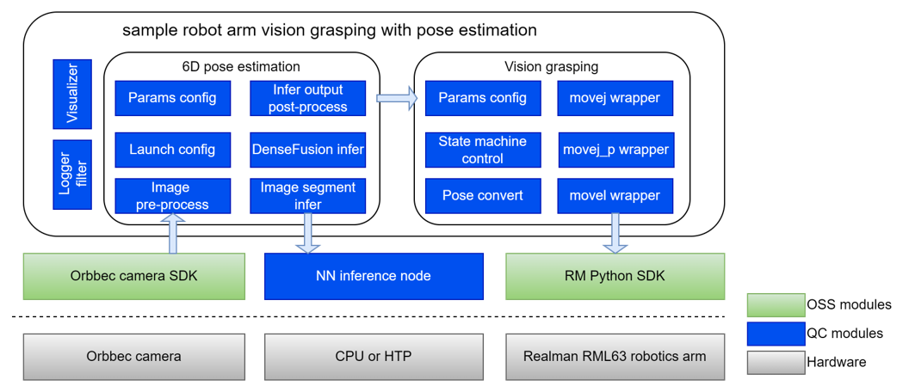

<!-- Copyright (c) 2025 Qualcomm Innovation Center, Inc. All rights reserved. -->
<!-- SPDX-License-Identifier: BSD-3-Clause-Clear -->


<div>
  <h1>Sample Robot Arm Grasping with Pose Estimation</h1>
</div>

---

## 👋 Overview

- This sample is a **real-robot** vision-guided grasping workflow (no Gazebo simulation). It combines RGB-D pose estimation with an RML63-class arm and gripper control over the vendor RM API.
- **Perception:** `grasp_perception` runs DenseFusion ONNX inference on synchronized color/depth images, with optional YOLO instance segmentation when no mask topic is supplied.
- **Execution:** `grasp_execution` subscribes to `grasp_perception_msgs/PoseEstimationResult` and runs the grasp state machine on the physical arm.
- **Messages:** `grasp_perception_msgs` defines the compact pose result type consumed by the executor.



| Package / component | Function |
| ------------------- | -------- |
| `grasp_perception` | RGB-D sync, YOLO mask (optional), DenseFusion ONNX pose; publishes `/pose_estimation_result` and auxiliary geometry topics. |
| `grasp_execution` | Vision-guided grasping: RM arm API, hand–eye style transforms, ROS 2 pose subscription. |
| `grasp_perception_msgs` | `PoseEstimationResult` and related interfaces for the perception → execution boundary. |

Typical hardware: **Orbbec D335** (or compatible RGB-D) + **RML63** arm with vendor networking/SDK.

## 🔎 Table of contents

- [👋 Overview](#-overview)
- [🔎 Table of contents](#-table-of-contents)
- [⚓ Used ROS topics](#-used-ros-topics)
- [🎯 Supported targets](#-supported-targets)
- [✨ Installation](#-installation)
- [🚀 Usage](#-usage)
- [⚙️ Configuration](#️-configuration)
- [👨‍💻 Build from source](#-build-from-source)
- [🤝 Contributing](#-contributing)
- [❤️ Contributors](#️-contributors)
- [❔ FAQs](#-faqs)
- [📜 License](#-license)

## ⚓ Used ROS topics

| ROS topic | Type | Description |
| --------- | ---- | ----------- |
| `/camera/color/image_raw` | `sensor_msgs/msg/Image` | RGB image input for perception (default; overridable via launch parameters). |
| `/camera/depth/image_raw` | `sensor_msgs/msg/Image` | Depth image synchronized with RGB (encodings such as `16UC1` / `32FC1` supported in node). |
| `/mask_topic`*(optional mask)* | `sensor_msgs/msg/Image` | Optional segmentation mask topic when `mask_topic` is set non-empty (skips YOLO in node). |
| `/pose_stamp` | `geometry_msgs/msg/PoseStamped` | Auxiliary pose output from perception. |
| `/pose_stamp_offset` | `geometry_msgs/msg/Vector3Stamped` | Translation offset output from perception. |
| `/pose_stamp_rotation_matrix` | `std_msgs/msg/Float64MultiArray` | Flattened 3×3 rotation matrix from perception. |
| `/pose_estimation_result` | `grasp_perception_msgs/msg/PoseEstimationResult` | Primary result: header, `frame_id`, 3×3 rotation, 3-vector translation (executor default input). |

## 🎯 Supported targets

<table>
  <tr>
    <th>Development hardware</th>
    <th>Hardware overview</th>
  </tr>
  <tr>
    <td>Qualcomm Dragonwing™ IQ-9075 EVK</td>
    <td>
      <a href="https://www.qualcomm.com/products/internet-of-things/industrial-processors/iq9-series/iq-9075">
        
      </a>
    </td>
  </tr>
</table>

**Robot & sensor (sample assumptions)**

- RML63-series arm reachable over the network (default executor IP `192.168.1.18`; configurable).
- RGB-D camera publishing aligned `/camera/color/image_raw` and `/camera/depth/image_raw` (e.g. Orbbec D335 with vendor ROS 2 driver).

## ✨ Installation

> [!IMPORTANT]
> Run on **Qualcomm Ubuntu** (or your target Linux) with **ROS 2 Jazzy** when integrating with the rest of the QRB ROS stack.<br>
> Refer to [Install Ubuntu on Qualcomm IoT Platforms](https://ubuntu.com/download/qualcomm-iot) and [ROS 2 Jazzy](https://docs.ros.org/en/jazzy/Installation.html).<br>
> For Qualcomm Linux robotics SDK context, see [Qualcomm Intelligent Robotics Product SDK](https://docs.qualcomm.com/bundle/publicresource/topics/80-70018-265/introduction_1.html?vproduct=1601111740013072&version=1.4&facet=Qualcomm%20Intelligent%20Robotics%20Product%20(QIRP)%20SDK).

> [!CAUTION]
> This demo targets a **real manipulator**. Verify workspace limits, emergency stop, and personnel safety before enabling motion.

- Prerequisites installation
```bash
cd robotics/sample_robot_arm_grasping_with_pose_estimation/scripts
chmod +x install.bash && bash install.bah
```

- (Optional)ONNX model export

If you need to regenerate ONNX assets instead of using the packaged files in `grasp_perception/models/`, use the `--onnx_export` to run `install.bash` as below:
```bash
bash install.bash --onnx_export
```

4. Download YOLO segmentation ONNX model from [Qualcomm AI Hub](https://aihub.qualcomm.com/iot/models/yolov11_seg?searchTerm=yolov) to `grasp_perception/models/yolo26n_seg_models/` path, then rename ONNX files to `yolo26n-seg.onnx` (or pass explicit launch arguments `pose_onnx_path`, `refine_onnx_path`, `yolo_seg_onnx_path`).

5. Please refer to [`Orbbec camera` official repository](https://github.com/orbbec/OrbbecSDK_v2) to install camera drive. Using test command to ensure `Orbbec camera` works well.
```bash
ros2 run orbbec_camera list_devices_node
```

There is no separate Debian meta-package documented for this sample; build the ROS packages from source as below.

## 🚀 Usage

The flow is: **bring up camera topics → launch perception → run grasp execution on the arm host** (same machine or ensure shared `ROS_DOMAIN_ID` and network reachability to the arm).

<details>
  <summary>End-to-end usage (after build)</summary>

1. **Camera driver** — start your RGB-D driver so `/camera/color/image_raw` and `/camera/depth/image_raw` are published with compatible encodings.

```bash
source /opt/ros/jazzy/setup.bash
export ROS_DOMAIN_ID=55   # optional; match your network
ros2 launch orbbec_camera gemini_330_series.launch.py depth_registration:=true align_mode:=SW align_target_stream:=COLOR color_width:=640 color_height:=480 color_fps:=15 depth_width:=640 depth_height:=480 depth_fps:=15
```

2. **Perception (live camera)** — from a sourced workspace that includes `grasp_perception`:

```bash
source /path/to/your_ws/install/setup.bash
export ROS_DOMAIN_ID=55   # optional; match your network
ros2 launch grasp_perception inference_with_camera_stream.launch.py
```

3. **Execution (real arm)** — in another terminal, with the same `ROS_DOMAIN_ID` if distributed:

```bash
source /path/to/your_ws/install/setup.bash
export ROS_DOMAIN_ID=55 # optional; match your network
# If not already installed editable:
python grasp_execution/grasp_execution/src/main.py --ip 192.168.1.18 --pose-topic /pose_estimation_result
```

4. **Perception (offline scene folder)** — publishes synthetic `/camera/...` from files and runs the same node:

```bash
source /path/to/your_ws/install/setup.bash
ros2 launch grasp_perception inference_with_local_file.launch.py \
  scene_dir:=/path/to/scene_with_rgb_and_depth_subfolders
```

Adjust `scene_dir` to a directory that contains your recorded `rgb/` and `depth/` images (see launch file defaults for layout).

</details>

## ⚙️ Configuration

- **Perception node defaults:** `grasp_perception/config/grasp_perception_node.yaml` (intrinsics, `obj_id`, YOLO thresholds, visualization flags, topics).
- **File replay publisher:** `grasp_perception/config/file_input_publisher.yaml`.
- **Launch arguments:** `grasp_perception/launch/inference_with_camera_stream.launch.py` and `inference_with_local_file.launch.py` (ONNX paths, topics, `scene_dir`, camera intrinsics overrides on local-file launch).
- **Executor:** `grasp_execution` CLI flags `--ip`, `--port`, `--pose-topic` (see `grasp_execution/src/core/grasp_execution.py`).

## 👨‍💻 Build from source

1. **Create a workspace** and add this sample under `src/` (symlink or copy the folder that contains `grasp_perception_msgs/` and `grasp_perception/`).

```bash
mkdir -p ~/qrb_grasp_ws/src && cd ~/qrb_grasp_ws/src
# Example: symlink from a full qrb_ros_samples (or qrb_ros_samples_external) checkout
ln -sf /path/to/<repository>/robotics/sample_robot_arm_grasping_with_pose_estimation .
```

If you clone the upstream monorepo instead, the path is typically `src/qrb_ros_samples/robotics/sample_robot_arm_grasping_with_pose_estimation`—adjust `--from-paths` and `cd` paths to match your layout.

2. **Install dependencies** from the sample path:

```bash
cd ~/qrb_grasp_ws
source /opt/ros/jazzy/setup.bash
sudo rosdep init 2>/dev/null || true
rosdep update
rosdep install -i --from-paths src/sample_robot_arm_grasping_with_pose_estimation --rosdistro jazzy -y
```

3. **Build ROS 2 packages** (`grasp_perception_msgs` first as a dependency):

```bash
cd ~/qrb_grasp_ws
source /opt/ros/jazzy/setup.bash
colcon build --packages-select grasp_perception_msgs grasp_perception
```

4. **Install execution package** (Python, uses `rclpy` and built messages):

```bash
cd ~/qrb_grasp_ws/src/sample_robot_arm_grasping_with_pose_estimation
source ~/qrb_grasp_ws/install/setup.bash
pip install -e grasp_execution/grasp_execution
```

5. Continue with [🚀 Usage](#-usage).

**ONNX models:** YCB DenseFusion and YOLO weights ship under `grasp_perception/models/` (see `.gitignore` for any LFS or large-binary policy). If a weight is missing locally, place files so paths in launch or YAML resolve, or pass explicit `pose_onnx_path`, `refine_onnx_path`, and `yolo_seg_onnx_path` arguments.

## 🤝 Contributing

We welcome contributions. Start with [CONTRIBUTING.md](../../CONTRIBUTING.md).  
Open an issue for bugs, safety concerns, or feature discussions.

## ❤️ Contributors

Thanks to everyone who improves this sample.

<table>
  <tr>
    <td style="text-align: center;">
      <a href="https://github.com/DotaIsMind">
        
        <br />
        <sub><b>teng</b></sub>
      </a>
    </td>
  </tr>
</table>

## ❔ FAQs

**Why does local-file launch mention a long default `scene_dir`?**  
The launch file ships with a developer placeholder path. Always override `scene_dir:=...` to your dataset root that contains paired RGB/depth frames.

**Executor says translation magnitude is large**  
`PoseEstimationResult.translation_vector` is interpreted in **meters**. If your pipeline exports millimeters, scale before publishing or adjust upstream.

**Can I run perception on the robot and Gazebo on a PC?**  
This sample is aimed at **real hardware**, not the Gazebo pick-and-place simulation. For simulation, see `robotics/simulation_sample_pick_and_place`.

## 📜 License

Packages in this sample declare **BSD-3-Clause-Clear** in their manifests. The repository root license is in [LICENSE](../../LICENSE).
