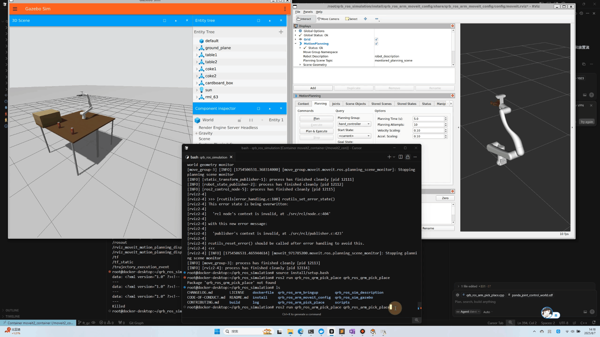
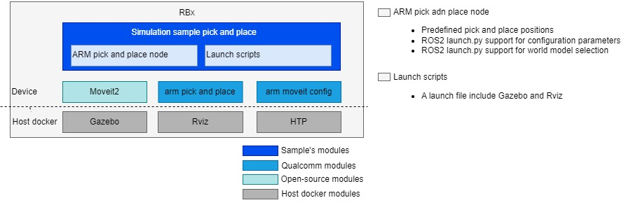

<div >
  <h1>Simulation Sample Pick and Place</h1>
  <p align="center">
</div>



---

## 👋 Overview

- The RML-63 Robotic Arm Pick and Place Demo is a C++-based robotic manipulation ROS2 node that demonstrates autonomous pick-and-place operations using MoveIt2 for motion planning and Gazebo for physics simulation.



| Node Name                                                    | Function                                                     |
| ------------------------------------------------------------ | ------------------------------------------------------------ |
| qrb_ros_simulation | Set up the Qualcomm robotic simulation environment, refer [qrb_ros_simulation](https://github.com/qualcomm-qrb-ros/qrb_ros_simulation). |
| qrb_ros_arm_pick_and_place     | Predefined pick and place positions. ROS2 launch.py support for configuration parameters. |


## 🔎 Table of contents

  * [Used ROS Topics](#-used-ros-topics)
  * [Supported targets](#-supported-targets)
  * [Installation](#-installation)
  * [Usage](#-usage)
  * [Build from source](#-build-from-source)
  * [Contributing](#-contributing)
  * [Contributors](#%EF%B8%8F-contributors)
  * [FAQs](#-faqs)
  * [License](#-license)

## ⚓ Used ROS Topics 

| ROS Topic                       | Type                                          | Description                    |
| ------------------------------- | --------------------------------------------- | ------------------------------ |
| `/joint_states`                   | `<sensor_msgs/msg/JointState> `                   | 	Real-time joint position, velocity, and effort data for all robot jointscontrolinfo              |
| `/hand_controller/controller_state` | `<control_msgs.msg.ControllerState>` |	Current state and status information of the gripper controller |
| `/hand_controller/joint_trajectory` |	`<trajectory_msgs.msg.JointTrajectory>` |	Trajectory commands sent to gripper joints for motion execution |
| `/rm_group_controller/controller_state` |	`<control_msgs.msg.ControllerState>` |	Current state and status information of the robotic arm controller |
| `/rm_group_controller/joint_trajectory` |	`<trajectory_msgs.msg.JointTrajectory>` |	Trajectory commands sent to arm joints for motion execution |
| `/robot_description` |	`<std_msgs.msg.String>` |	URDF robot description in XML format for robot modeling and visualization |
| `/robot_description_semantic` |	`<std_msgs.msg.String>` |	SRDF semantic robot description for MoveIt planning and configuration |

## 🎯 Supported targets

<table>
  <tr>
    <th>Development Hardware</th>
    <th>Hardware Overview</th>
  </tr>
  <tr>
    <td>Qualcomm Dragonwing™ IQ-9075 EVK</td>
    <td>
      <a href="https://www.qualcomm.com/products/internet-of-things/industrial-processors/iq9-series/iq-9075">
        
      </a>
    </td>
  </tr>
  <tr>
    <td>Qualcomm Dragonwing™ RB3 Gen2</td>
    <td>
      <a href="https://www.qualcomm.com/products/internet-of-things/industrial-processors/rb3-series/rb3-gen2">
        
      </a>
    </td>
  </tr>
</table>

## ✨ Installation

> [!IMPORTANT]

> **PREREQUISITES**: For Qualcomm Linux, please check out the [Qualcomm Intelligent Robotics Product SDK](https://docs.qualcomm.com/bundle/publicresource/topics/80-70020-265/quick_start.html?vproduct=1601111740013072&version=1.5&facet=Qualcomm%20Intelligent%20Robotics%20SDK#setup-demo-qs) documents.

## 🚀 Usage

<details>
  <summary>Usage details</summary>
Launch Gazebo and Rviz on HOST docker

```bash
source /usr/share/qirp-setup.sh
bash ./install/qrb_ros_arm_bringup/share/qrb_ros_arm_bringup/scripts/rml_63_gazebo_and_moveit_launch.sh
```
You can also launch the launch file with the following command:
```bash
ros2 launch qrb_ros_sim_gazebo gazebo_rml_63_gripper.launch.py
```
Click play button in Gazebo after rendered the world environment, and then use the following command to launch Rviz. 

```bash
ros2 launch qrb_ros_arm_moveit_config demo.launch.py
```
Make sure that after you started Gazebo and Rviz in the host Docker, you can select arm predefined state `ready` and `home` in Rviz to start the arm motion.

On device
if arm motion work normall, you can use the following command to start the pick and place node.
```bash
source /usr/share/qirp-setup.sh
ros2 run qrb_ros_arm_pick_place qrb_ros_arm_pick_place
```

Then you can see the arm execute pick and place operation in Gazebo and Rviz.

</details>

## 👨‍💻 Build from source

Coming soon ...

## 🤝 Contributing

We love community contributions! Get started by reading our [CONTRIBUTING.md](CONTRIBUTING.md).<br>
Feel free to create an issue for bug report, feature requests or any discussion💡.

## ❤️ Contributors

Thanks to all our contributors who have helped make this project better!

<table>
  <tr>
    <td style="text-align: center;">
      <a href="https://github.com/DotaIsMind">
        
        <br />
        <sub><b>teng</b></sub>
      </a>
    </td>
  </tr>
</table>


## ❔ FAQs

<details>
<summary>How to get origin output of the QNN inference node?</summary><br>
Comment the following code in depth_estimation_node.py to get the origin output of the QNN inference node.

```python
# Normalize to [0,255]
normalized = cv2.normalize(output_image, None, 0, 255, cv2.NORM_MINMAX)
colored = cv2.applyColorMap(normalized.astype(np.uint8), cv2.COLORMAP_INFERNO)
```
</details>


## 📜 License

Project is licensed under the [BSD-3-Clause](https://spdx.org/licenses/BSD-3-Clause.html) License. See [LICENSE](../LICENSE) for the full license text.