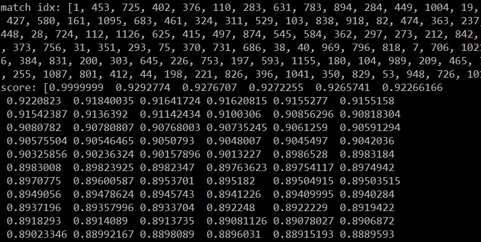

# Clothing Assistant Workflow

This project demonstrates a simple yet powerful LLM-powered research agent. This implementation is based directly on the tutorial: [LLM Agents are simply Graph — Tutorial For Dummies](https://zacharyhuang.substack.com/p/llm-agent-internal-as-a-graph-tutorial).

Reference : https://github.com/The-Pocket/PocketFlow/tree/main/cookbook/pocketflow-agent

## Thanks To

Example clothing pictures and metadata json are from : https://fashionpedia.github.io/home/Fashionpedia_download.html


ONNX models are from CLIP-AS-SERVICE : https://github.com/jina-ai/clip-as-service

- https://clip-as-service.s3.us-east-2.amazonaws.com/models/onnx/ViT-B-32/visual.onnx
- https://clip-as-service.s3.us-east-2.amazonaws.com/models/onnx/ViT-B-32/textual.onnx

## Features (planing)

- Search Clothing with Pictures (I want the clothing with same feeling of this pic)
- Search Clothing with Text
- Search Metadata with Pictures
- Use SQLite3 to build vector store, file_name as index


## Example Outputs


## Getting Started

1. Install the packages you need with this simple command:
```bash
pip install -r requirements.txt
```
2. Run agent :

```bash
python build_clothing_vector_store_sqlite3.py
```

## How It Works?

TBD