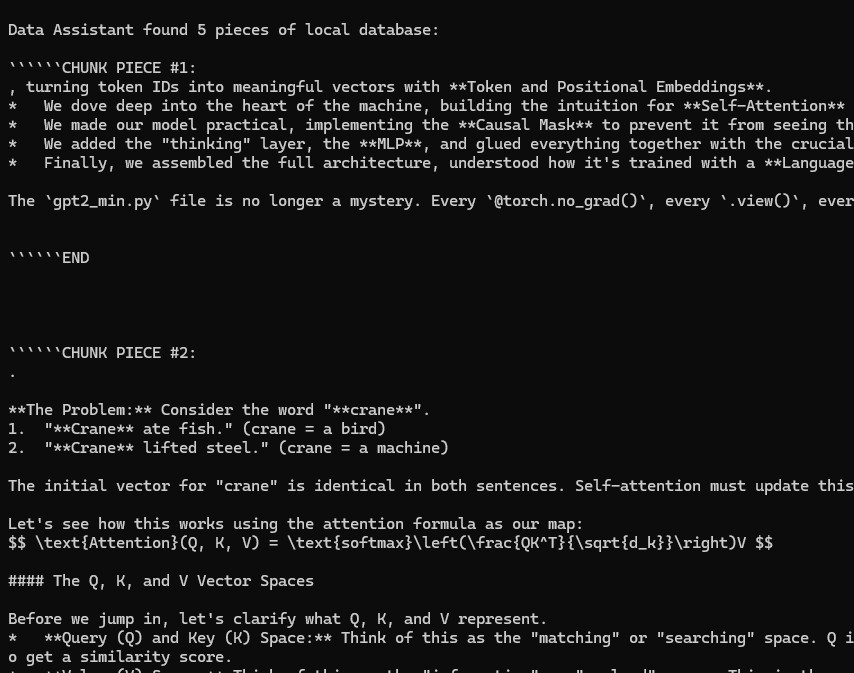
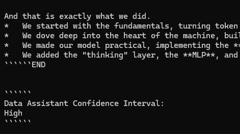
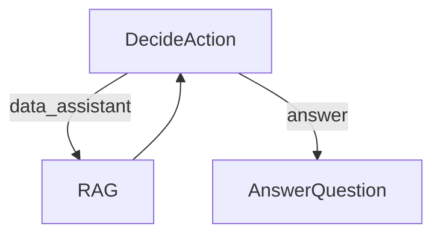

# Agent + Local File RAG

This project demonstrates a simple yet powerful LLM-powered research agent. This implementation is based directly on the tutorial: [LLM Agents are simply Graph — Tutorial For Dummies](https://zacharyhuang.substack.com/p/llm-agent-internal-as-a-graph-tutorial).

Reference : https://github.com/The-Pocket/PocketFlow/tree/main/cookbook/pocketflow-agent

## Features

- Performs get and use tools via MCP format
- Makes decisions about when to use tools vs. when to answer
- Generates answers based on tool result
- **Save Results into local file system (current path)**

## Example Outputs



## Getting Started

1. Install the packages you need with this simple command:
```bash
pip install -r requirements.txt
```
2. Run agent :

```bash
python qrb_local_rag.py
```

## How It Works?

The magic happens through a simple but powerful graph structure with three main parts:



Here's what each part does:
1. **DecideAction**: The brain that figures out whether to search or answer
2. **RAG**: The researcher that goes out and finds information
3. **AnswerQuestion**: The writer that crafts the final answer

Here's what's in each file:
- [`qrb_local_rag.py`](./qrb_local_rag.py): The starting point - runs the whole show!
- [`test_rag_chunk.py`](./test_rag_chunk.py): this is the minimal test of how to encode chunks and compute similarity